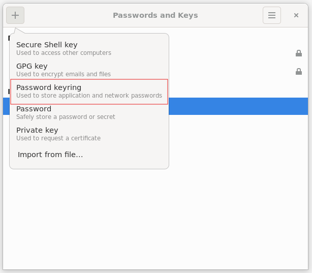
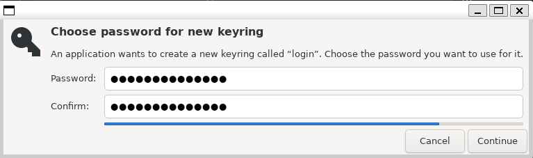
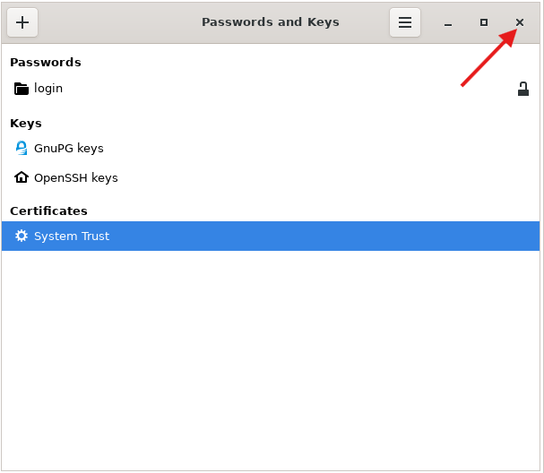

---
# Required metadata
# For more information, see https://review.learn.microsoft.com/en-us/help/platform/learn-editor-add-metadata?branch=main
# For valid values of ms.service, ms.prod, and ms.topic, see https://review.learn.microsoft.com/en-us/help/platform/metadata-taxonomies?branch=main

title:       Use MSAL.NET with an authentication broker on Linux
description: "Learn how to use MSAL.NET with a broker on the Linux platform."
author:      xinyuxu1026 # GitHub alias
ms.author:   xinyuxu # Microsoft alias
ms.service:  msal
# ms.prod:   # To use ms.prod, uncomment it and delete ms.service
ms.topic:    how-to
ms.date:     05/05/2025
---

# Use MSAL.NET with an authentication broker on Linux


> [!NOTE]
> Microsoft single sign-on (SSO) for Linux authentication broker support is introduced with `Microsoft.Identity.Client` version v4.69.1.

Using an authentication broker on Linux enables you to simplify how your users authenticate with Microsoft Entra ID from your application, as well as take advantage of future functionality that protects Microsoft Entra ID refresh tokens from exfiltration and misuse.

An authentication broker is **not** pre-installed on standalone Linux but is bundled as a dependency of applications developed by Microsoft, such as [Company Portal](/mem/intune-service/user-help/enroll-device-linux). These applications are usually installed when a Linux computer is enrolled in a company's device fleet via an endpoint management solution like [Microsoft Intune](/mem/intune/fundamentals/what-is-intune). For [Windows Subsystem for Linux](/windows/wsl/about) (WSL) scenario, WAM (Windows Account Manager) is used as the broker. WAM does come pre-installed on the Windows system. To learn more about Linux device set up with the Microsoft Identity Platform, see [Microsoft Enterprise SSO plug-in for Apple devices](/entra/identity-platform/apple-sso-plugin).

## Prerequisites

MSAL.NET project requires .NET version greater or equal than the version specified in [global.json](https://github.com/AzureAD/microsoft-authentication-library-for-dotnet/blob/main/global.json) file, we recommend register the Microsoft package repository and install .NET, please follow the instructions here: [Install .NET on Ubuntu](/dotnet/core/install/linux-ubuntu-decision#register-the-microsoft-package-repository). And please make sure you have all the [.NET required dependencies](/dotnet/core/install/linux-ubuntu-decision#dependencies) installed.

To use the broker, you'll need to install a list of dependencies on the Linux platform:

```bash
libc++-dev
libc++abi-dev
libsecret-tools
libwebkit2gtk-4.0-dev
```

## Create a console app on Linux platform

To use a broker on the Linux platform, set the `BrokerOptions` to `OperatingSystems.Linux`. Notice that we use the same option for both Windows Subsystem for Linux (WSL) and standalone Linux.

```csharp
using Microsoft.Identity.Client;
using Microsoft.Identity.Client.Broker;

class Program
{
    public static string ClientID = "your client id"; //msidentity-samples-testing tenant
    public static string[] Scopes = { "User.Read" };
    static void Main(string[] args)
    {
        IPublicClientApplication pcaBuilder = PublicClientApplicationBuilder.Create(ClientID)
            .WithAuthority("https://login.microsoftonline.com/common")
            .WithDefaultRedirectUri()
            .WithBroker(new BrokerOptions(BrokerOptions.OperatingSystems.Linux)
            {
                ListOperatingSystemAccounts = true,
                MsaPassthrough = true,
                Title = "MSAL WSL Test App"
            })
            .Build();

        AcquireTokenInteractiveParameterBuilder atParamBuilder = pcaBuilder.AcquireTokenInteractive(Scopes);

        AuthenticationResult authenticationResult = atParamBuilder.ExecuteAsync().GetAwaiter().GetResult();
        Console.WriteLine(authenticationResult.AccessToken);
    }
}
```

## Sample App 
A sample application is available for developers who want to try the authentication broker on Linux. The application is located [in the MSAL.NET GitHub repository](https://github.com/AzureAD/microsoft-authentication-library-for-dotnet/tree/main/tests/devapps/WAM/NetWSLWam). The app has a dependency of `libx11-dev` package. 

On Debian-based distributions, run `sudo apt install libx11-dev` to install the package. The `libx11` library is used to get the console window handle on Linux. Here's the sample code to use `libx11` to get the window handle:

```csharp
using System;
using System.Runtime.InteropServices;

class X11Interop
{
    [DllImport("libX11")]
    public static extern IntPtr XOpenDisplay(IntPtr display);

    [DllImport("libX11")]
    public static extern IntPtr XDefaultRootWindow(IntPtr display);

    public static void Main()
    {
        IntPtr display = XOpenDisplay(IntPtr.Zero);
        if (display == IntPtr.Zero)
        {
            Console.WriteLine("Unable to open X display.");
            return;
        }

        IntPtr rootWindow = XDefaultRootWindow(display);
        Console.WriteLine($"Root window handle: {rootWindow}");
    }
}
```

To run the sample app, use the following command:
```dotnetcli
dotnet run --project tests\devapps\WAM\NetWSLWam\test.csproj
```

## WSL Scenario

### Update to the latest version of WSL

Enure you have updated to the latest WSL release. The WAM Account Control dialog is supported in WSL versions 2.4.13 and above. Using the broker isn't possible with earlier versions. To check the WSL version, use the following command:

```powershell
wsl --version
```

To update WSL, run the following command from Windows Terminal:

```powershell
wsl --update
```

### Set up Keyring in WSL
MSAL uses `libsecret` on Linux. It is required to communicate with the `keyring` daemon. Users can use [Seahorse](https://wiki.gnome.org/Apps/Seahorse/) (a GNOME application for managing encryption keys and passwords) to manage the `keyring` contents through a Graphical User Interface (GUI).

On Debian-based distributions, you can install the package by running `sudo apt install seahorse` and then following these instructions:

1. Run `seahorse` in the terminal.
2. In the top left corner, click **+** and create **Password** keyring. 



3. Create a keyring named 'login' and set the password.






4. Run `wsl.exe --shutdown` from your Windows Terminal.
5. Start a new WSL session and run the sample. You should be asked for the keyring password.
