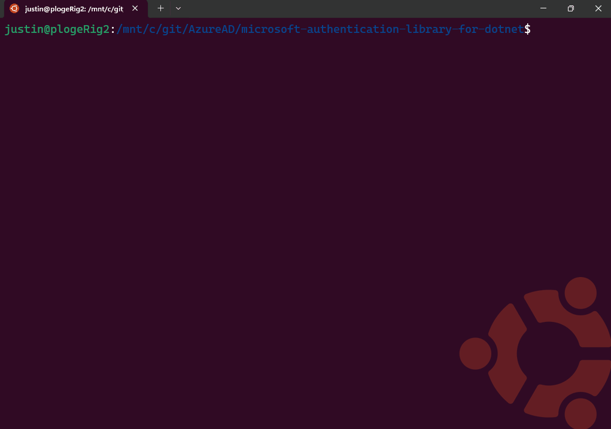

# Enable SSO in WSL (Windows Subsystem for Linux) apps using MSAL.NET and WAM

MSAL is able to call the Microsoft Single Sign-on to Linux, a Linux component that is shipped independent of the Linux Distribution, however it gets installed using a package manager using `sudo apt install microsoft-identity-broker` or `sudo dnf install microsoft-identity-broker`.

This component acts as an authentication broker allowing the users of your app to benefit from integration with accounts known to Linux, such as the account you signed into your Linux sessions for apps that consume from the broker. It's also bundled as a dependency of applications developed by Microsoft, such as [Company Portal](/mem/intune-service/user-help/enroll-device-linux). These applications are installed when a Linux computer is enrolled in a company's device fleet via an endpoint management solution like [Microsoft Intune](/mem/intune/fundamentals/what-is-intune).

> [!NOTE]
> Microsoft single sign-on (SSO) for Linux authentication broker support is introduced with `Microsoft.Identity.Client` version v4.69.1.

Using an authentication broker on Linux enables you to simplify how your users authenticate with Microsoft Entra ID from your application, and take advantage of future functionality that protects Microsoft Entra ID refresh tokens from exfiltration and misuse.

To enable SSO in your WSL app using MSAL.NET, you must ensure the keychain is set up and unlocked, as MSAL uses `libsecret` to communicate with the keyring daemon.

## User sign-in experience

This video demonstrates the sign-in experience on brokered flows on Linux




## Update to the latest version of WSL

Ensure you have updated to the latest WSL release. The WAM Account Control dialog is supported in WSL versions 2.4.13 and above.

```powershell
# To check what distros are available:
wsl.exe --list --online

wsl.exe --install Ubuntu-22.04

# To check the WSL version:
wsl --version

# To update WSL:
wsl --update
```

## Prerequisites

### .NET Installation
Identity integration dependent on having dotnet 8 installed on the Linux distribution, and recommend installing via the [installation script](/dotnet/core/install/linux-scripted-manual#scripted-install).

```bash
# Download the install script
wget https://dot.net/v1/dotnet-install.sh -O dotnet-install.sh
chmod +x ./dotnet-install.sh
./dotnet-install.sh --version latest

# To update the path if using bash (remember to reset your connection afterword):
vi .bashrc
export DOTNET_ROOT=~/.dotnet
export PATH=$PATH:$DOTNET_ROOT:$DOTNET_ROOT/tools
```

### Package Dependencies 

Install the following dependencies on your Linux platform:

- `libsecret-tools` is required to interface with the Linux keychain
- `libx11-dev` package, where the `libx11` library is used to get the console window handle on Linux.

### [Ubuntu](#tab/ubuntudep)

To install on debian/Ubuntu based Linux distribution:

```bash
sudo apt install libx11-6 libc++1 libc++abi1 libsecret-1-0 libwebkit2gtk-4.0-37 -y

#from Powershell, run
wsl.exe --shutdown
```

### [Red Hat Enterprise Linux](#tab/rheldep)

To install on Red Hat/Fedora based Linux distribution:

```bash
sudo dnf install libx11-6 libc++1 libc++abi1 libsecret-1-0 libwebkit2gtk-4.0-37 -y

#from Powershell, run
wsl.exe --shutdown
```

---

> [!IMPORTANT]
> In order for the keychain to work as intended, you should make sure you 1. install the dependencies, 2. Reboot/restart wsl, 3. Configure the keychain. Failure to do the steps in the correct order will result with the keychain missing the option for "Password Keychain".


### Set up Keyring in WSL

MSAL uses `libsecret` on Linux. It's required to communicate with the `keyring` daemon. Users can use [Seahorse](https://wiki.gnome.org/Apps/Seahorse/) (a GNOME application for managing encryption keys and passwords) to manage the `keyring` contents through a Graphical User Interface (GUI).

On Debian-based distributions, you can install the package by running `sudo apt install seahorse` and then following these instructions:

1. Run `seahorse` in the terminal as a regular user (not as sudo)

    

2. In the top left corner, select **+** and create **Password** keyring.

    

3. Create a keyring named 'login'

    

4. Set the password on the next dialog.
    

5. Run `wsl.exe --shutdown` from your Windows Terminal.

6. Start a new WSL session and run the sample. You should be asked for the keyring password.


## Run a Sample App

To use a broker on the Linux platform, make sure you set the `BrokerOptions` to `OperatingSystems.Linux` as shown in the below code snippet:

Reference the [Enable SSO in native Linux apps using MSAL.NET](./linux-dotnet-sdk.md) for information of how to configure the project.

To set up a test app, you use the sample app provided in [microsoft-authentication-library-for-dotnet](https://github.com/AzureAD/microsoft-authentication-library-for-dotnet) under the path [/tests/devapps/WAM/NetWSLWam/Class1.cs](https://github.com/AzureAD/microsoft-authentication-library-for-dotnet/blob/main/tests/devapps/WAM/NetWSLWam/Class1.cs)


To run the sample app:

```bash
# Run From the root folder of microsoft-authentication-library-dotnet directory
dotnet run --project tests/devapps/WAM/NetWSLWam/test.csproj
```