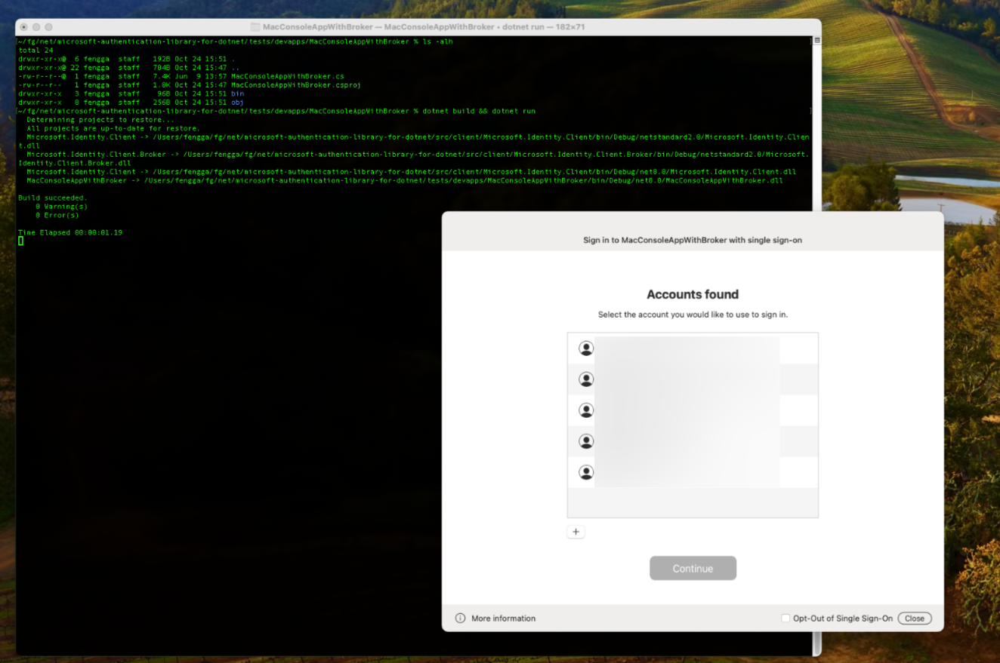

# Using MSAL.NET with the macOS broker

MSAL.NET can integrate with the macOS authentication broker to provide rich single sign-on (SSO) and secure token acquisition by leveraging accounts known to the operating system. This allows users of your app to sign in using an existing Microsoft Entra ID (Azure AD) or Microsoft account with fewer prompts and improved security posture.

## What is a broker

An authentication broker is a component or application that runs on the user's machine and manages authentication handshakes and token lifecycle for connected accounts. On Windows this role is performed by Web Account Manager (WAM). On macOS the broker comes with the Company Portal app. Key benefits include:

- **Enhanced security.** Security improvements to token handling and credential prompts are delivered via OS updates or broker updates without requiring app code updates.
- **Feature support.** The broker enables access to Windows-equivalent features where available (Conditional Access, device compliance checks) and leverages macOS secure enclaves and system keychain.
- **System integration.** Users can reuse existing signed-in accounts, reducing credential re-entry and improving productivity.
- **Token protection.** The broker ensures refresh tokens are bound appropriately to the device context and supports acquisition of proof-of-possession (PoP) access tokens when configured.

## Enabling the macOS broker

> [!IMPORTANT]
> Use MSAL.NET 4.73.1 or higher to get macOS broker support. We recommend using the latest version of `Microsoft.Identity.Client` and `Microsoft.Identity.Client.Broker`.

> [!IMPORTANT]
> Enroll the macOS device using [Company Portal app](https://learn.microsoft.com/intune/intune-service/user-help/enroll-your-device-in-intune-macos-cp). After the enrollment finished, make sure the other Microsoft apps can talk to the broker via SSO extension (for example, you can sign in Word via Company Portal)

Broker support is split across two packages:

- [Microsoft.Identity.Client](https://www.nuget.org/packages/Microsoft.Identity.Client/) – core library for token acquisition.
- [Microsoft.Identity.Client.Broker](https://www.nuget.org/packages/Microsoft.Identity.Client.Broker/) – adds support for authentication via platform brokers (Windows WAM, macOS broker, Linux broker, etc.).

After referencing the relevant packages, call [`WithBroker(BrokerOptions)`](xref:Microsoft.Identity.Client.Broker.BrokerExtension.WithBroker*) with the macOS broker configuration. Unlike on Windows, for macOS broker flows does not support setting parent window handle.

> [!NOTE]
> Ensure you add a `using Microsoft.Identity.Client.Broker;` statement to access the correct `WithBroker` extension overload. The broker API is unified; you specify supported operating systems within `BrokerOptions`.

### Sample: Enable broker in a macOS .NET app

Enabling macOS broker flows could be as simple as:

```csharp
    PublicClientApplicationBuilder builder = PublicClientApplicationBuilder
        .Create("04b07795-8ddb-461a-bbee-02f9e1bf7b46") // Azure CLI client id
        .WithRedirectUri("msauth.com.msauth.unsignedapp://auth")
        .WithAuthority("https://login.microsoftonline.com/organizations");

    builder = builder.WithLogging(SampleLogging);

    builder = builder.WithBroker(new BrokerOptions(BrokerOptions.OperatingSystems.OSX)
    // For Windows, please use BrokerOptions(BrokerOptions.OperatingSystems.Windows)
    {
        ListOperatingSystemAccounts = false,
        MsaPassthrough = false,
        Title = "MSAL Dev App .NET FX"
    }
    );

    IPublicClientApplication pca = builder.Build();

    // All the interactive APIs are required to be executed on the main thread
    AcquireTokenInteractiveParameterBuilder interactiveBuilder = pca.AcquireTokenInteractive(new string[] { "https://graph.microsoft.com/.default" });
    AuthenticationResult result = await interactiveBuilder.ExecuteAsync(CancellationToken.None).ConfigureAwait(false);

    IAccount account = result.Account;
    AcquireTokenSilentParameterBuilder silentBuilder = pca.AcquireTokenSilent(new string[] { "https://graph.microsoft.com/.default" }, account);
    result = await silentBuilder.ExecuteAsync(CancellationToken.None).ConfigureAwait(false);
```

Because the broker prompt uses native macOS UI, interactive token acquisition must execute on the main (UI) thread. **All interactive MSAL.NET broker calls (for example `AcquireTokenInteractive`) need to happen on the main thread**. Calling these APIs from a background thread will throw an exception:

```
Microsoft.Identity.Client.MsalClientException: Interactive requests with mac broker enabled must be executed on the main thread on macOS.
```

In a UI-based app (such as a .NET MAUI or AppKit app) this is usually seamless because the framework's message loop runs on the main thread, please refer to [this MAUI sample app](https://github.com/AzureAD/microsoft-authentication-library-for-dotnet/blob/main/tests/devapps/MacMauiAppWithBroker/MainPage.xaml.cs).

In console applications, async operations (like HTTP requests) often resume on thread-pool threads; make sure you marshal back to the main thread before invoking interactive APIs. 

### Sample: console app with main thread schieduler

MSAL.NET provides a [MacMainThreadScheduler](https://github.com/AzureAD/microsoft-authentication-library-for-dotnet/blob/4c04a5860490c56716a92715e92b2d607aaf1a9e/src/client/Microsoft.Identity.Client/Utils/MacMainThreadScheduler.cs#L30) to maintain main thread context:

```csharp
class MacConsoleAppWithBroker
{
    private static MacMainThreadScheduler macMainThreadScheduler = MacMainThreadScheduler.Instance();
    static void Main(string[] args)
    {
        _ = Task.Run(() => BackgroundWorker());
        macMainThreadScheduler.StartMessageLoop();
    }
    private static async Task BackgroundWorker()
    {
        await macMainThreadScheduler.RunOnMainThreadAsync(async () =>
        {
            // Your code here will be running on main thread
        }).ConfigureAwait(false);
    }
}


class YourDotnetConsoleApp
{
    private static MacMainThreadScheduler macMainThreadScheduler = MacMainThreadScheduler.Instance();

    static void Main(string[] args)
    {
        _ = Task.Run(() => BackgroundWorker());

        macMainThreadScheduler.StartMessageLoop(); // Enter main thread scheduler's message loop
    }

    private static async Task BackgroundWorker()
    {
        AcquireTokenInteractiveParameterBuilder interactiveBuilder = pca.AcquireTokenInteractive(new string[] { "https://graph.microsoft.com/.default" });
        AuthenticationResult? result = null;

        // Acquire token interactively on main thread
        await macMainThreadScheduler.RunOnMainThreadAsync(async () =>
        {
            result = await interactiveBuilder.ExecuteAsync(CancellationToken.None).ConfigureAwait(false);
            Console.WriteLine("Interactive authentication completed successfully.");
        }).ConfigureAwait(false);
    }

```
For more details, please refer to [this console sample app](https://github.com/AzureAD/microsoft-authentication-library-for-dotnet/blob/main/tests/devapps/MacConsoleAppWithBroker/MacConsoleAppWithBroker.cs).



## On macOS, MSAL.NET does not support setting parent window

Due to security reason, macOS does not allow a console app obtain the terminal app's window information, MSAL.NET does not support setting parent window on macOS. The popped up broker prompt will be in the middle of the screen, and it will always be in the foreground.

## Proof-of-Possession (PoP) access tokens

The macOS broker supports acquiring PoP tokens for public client flows. See [Proof-of-Possession tokens](../../advanced/proof-of-possession-tokens.md) for configuration details and scenarios.

## Redirect URI

For GUI app with correct Apple package bundles:
- Use `msauth.[bundle_id]://auth` as redirect_uri

For script:
- Unsigned executable: use `msauth.com.msauth.unsignedapp://auth`
- Signed executable: support is coming soon. Currently, the broker will block requests from signed executables that are not bundled apps. 

## Supported macOS versions and architectures

The macOS broker supports the following configurations:

| Component | Supported versions |
|-----------|-------------------|
| **Architecture** | ARM64 (Apple Silicon) and x64 (Intel) |
| **macOS version** | macOS 10.15 (Catalina) and later |

> [!TIP]
> We recommend updating to the latest macOS version to ensure compatibility with the newest security features and broker capabilities.

## macOS broker limitations

- Azure AD B2C and Active Directory Federation Services (ADFS) authorities are not supported via the macOS broker.
- Older macOS versions (earlier than 10.15) are not supported.
- Running in non-interactive contexts (non-main thread context) will fail for interactive broker flows by design.
- Third-party IDPs are not supported.


## See also
- [Enroll your macOS device using the Company Portal app](https://learn.microsoft.com/intune/intune-service/user-help/enroll-your-device-in-intune-macos-cp)
- [Add the macOS Company Portal App](https://learn.microsoft.com/intune/intune-service/apps/apps-company-portal-macos)
- [Using MSAL.NET with Web Account Manager (WAM) on Windows](wam.md)
