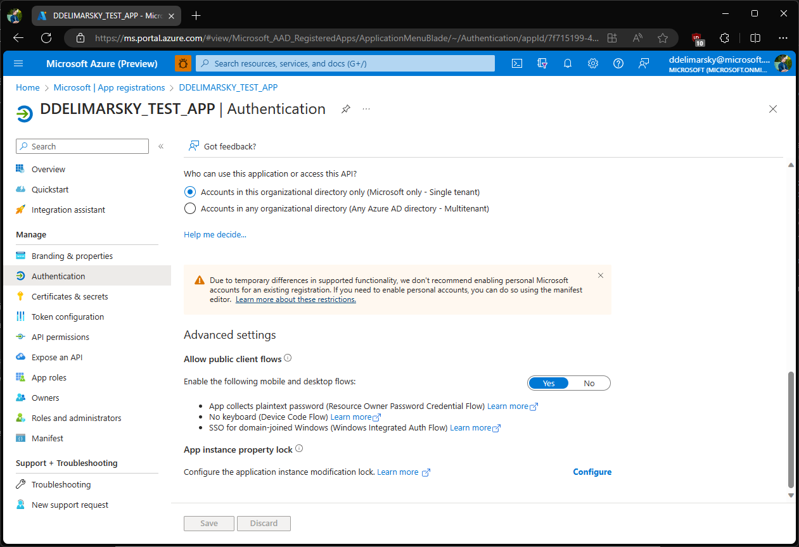

# Username and password (ROPC) authentication with MSAL.NET

In your desktop applications you can use the username and password flow (also known as Resource Owner Password Credentials, or ROPC) to acquire a token silently. No UI is required when using the application.

>[!WARNING]
> The ROPC flow is **not recommended** as the application will be asking a user for their password directly, which is an insecure pattern. For more information about the risks and challenges the ROPC flow poses, refer to ["What’s the solution to the growing problem of passwords? You, says Microsoft"](https://news.microsoft.com/features/whats-solution-growing-problem-passwords-says-microsoft/). The preferred flow for acquiring a token silently on Windows is using the [Windows authentication broker](wam.md). Alternatively, developers can also use the [Device code flow](../desktop-mobile/device-code-flow.md) on devices without access to the web browser.

Although the ROPC flow is useful in limited cases where developers want to provide their own UI for credential acquisition, there are a number of important trade-offs. By using the flow, developers are giving up a number of things:

- Core tenets of modern identity, such as paswordless patterns - if the password gets phished, it can then be replayed.
- Users who need to do Multi-factor Authentication (MFA) won't be able to sign-in, as there are no interaction affordances.
- Single Sign-On (SSO) support.

## Constraints

In addition to the [Integrated Windows Authentication constraints](integrated-windows-authentication.md#iwa-constraints), the following also apply:

- Available starting with MSAL 2.1.0.
- Not compatible with conditional access and multi-factor authentication. As a consequence, if the app runs in a Microsoft Entra tenant where the tenant admin requires multi-factor authentication, the flow cannot be used.
- Only available for work and school accounts and **not** personal Microsoft accounts.
- Available on .NET Framework and .NET/.NET Core.

### Authority implications

| Tenant                                                                         | Description                                        | Supports ROPC |
|:-------------------------------------------------------------------------------|:---------------------------------------------------|:--------------|
| `common`                                                                       | Work, school, and personal accounts.               | ❌ No        |
| `organizations`                                                                | Work and school accounts.                          | ✅ Yes       |
| `consumers`                                                                    | Personal Microsoft accounts.                       | ❌ No        |
| Specific tenant (GUID or fully-qualified name, like `contoso.onmicrosoft.com`) | Work and school accounts from the specific tenant. | ✅ Yes       |

>[!NOTE]
>To learn more about using the ROPC flow with Azure AD B2C, refer to [Use MSAL.NET to sign in users with social identities](/azure/active-directory/develop/msal-net-aad-b2c-considerations).

## Usage

### Application registration

During the [app registration](https://go.microsoft.com/fwlink/?linkid=2083908), in the **Authentication** section for your application, choose **Yes** as the answer to the question **Allow public client flows** (which includes **App collects plaintext password (Resource Owner Password Credential Flow)**).



>[!NOTE]
>If your application supports authentication with personal Microsoft accounts, ROPC flow will not be available **even if** your application also supports authentication with work and school accounts.

### Sample code

ROPC flow is only available for public client applications. To use it, developers can leverage the [`PublicClientApplication`](xref:Microsoft.Identity.Client.PublicClientApplication) class, which contains the [`AcquireTokenByUsernamePassword`](xref:Microsoft.Identity.Client.AcquireTokenByUsernamePasswordParameterBuilder) method.

The following sample showcases a simplified use-case:

>[!NOTE]
>Replace `/contoso.com` in the authority URL with your tenant ID or `/organizations`.

The following sample presents the most current use-case:

```csharp
static async Task GetATokenForGraph()
{
    string authority = "https://login.microsoftonline.com/contoso.com";
    string[] scopes = new string[]
    {
        "user.read"
    };

    IPublicClientApplication app;
    app = PublicClientApplicationBuilder.Create(clientId).WithAuthority(authority).Build();

    var accounts = await app.GetAccountsAsync();
    AuthenticationResult result = null;

    if (accounts.Any())
    {
        result = await app.AcquireTokenSilent(scopes, accounts.FirstOrDefault()).ExecuteAsync();
    }
    else
    {
        try
        {
            result = await app.AcquireTokenByUsernamePassword(scopes, "joe@contoso.com", "joepassword").ExecuteAsync();
        }
        catch (MsalException)
        {
            // Handle various potential exceptions.
        }
    }
    Console.WriteLine(result.Account.Username);
}
```

## Protocol documentation

See [Azure Active Directory v2.0 and the OAuth 2.0 resource owner password credential](/azure/active-directory/develop/v2-oauth-ropc) to learn more about the underlying protocol.

## End-to-end samples

| Sample | Platform | Description |
| ------ | -------- | ----------- |
| [active-directory-dotnetcore-console-up-v2](https://github.com/Azure-Samples/active-directory-dotnetcore-console-up-v2) | Console (.NET Core) | .NET Core console application letting a user signed-in with the Azure AD v2.0 endpoint using username and password to acquire a token for Microsoft Graph. ! [Console app topology](../../media/console-app-topology.png) |
