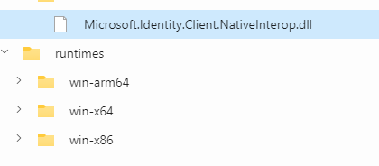

# Using MSAL.NET with Web Account Manager (WAM)

MSAL is able to call Web Account Manager (WAM), a Windows 10+ component that ships with the OS. This component acts as an authentication broker allowing the users of your app benefit from integration with accounts known to Windows, such as the account you signed into your Windows session.

## What is a broker

An authentication broker is an application that runs on a user’s machine that handles the authentication handshakes and token maintenance for connected accounts. As its authentication broker, the Windows operating system uses the Web Account Manager (WAM). It has many benefits for developers and customers alike including

- **Enhanced security.** The client application does not need to manage the refresh token which can be used to obtain new authentication tokens without the user consent.
- **Feature support.** With the help of the broker developers can access rich OS and service capabilities such as Windows Hello, conditional access policies, and FIDO keys without writing extra scaffolding code.
- **System integration.** Applications that use the broker plug-and-play with the built-in account picker, allowing the user to quickly pick an existing account instead of reentering the same credentials over and over.

With the help of a broker you need to write less code to handle token-related logic while also being able to use more advanced functionality, such as [Proof-of-Possession tokens](../../advanced/proof-of-possession-tokens.md). Moving forward, our team is continuing to invest in making sure that brokers are the de-facto approach to authenticate with MSAL-based applications, where possible.

## Improved Windows broker experience

Recently, an updated authentication broker experience was made available for Windows systems. The new broker is written in C++, is well tested, and is significantly more performant and secure. One of the biggest consumers of the new broker experience is the Microsoft 365 suite of apps.

> [!IMPORTANT]
> With the introduction of the updated broker, we’ve also updated MSAL.NET to expose its capabilities under a simplified API. Starting with version 4.52.0, the improved broker experience in MSAL.NET will replace the existing broker flows by default.

The improved WAM broker fixes a number of issues with the legacy WAM implementation and provides other benefits:

- New implementation is more stable, easier to add new features, and has less chance of regressions.
- Works in apps that are run-as-admin.
- Adds support for Proof-of-Possession tokens.
- Fixes assembly size issues.

## Enabling WAM

Due to platform-specific and backwards compatibility requirements, WAM implementation resides in three packages:

- [Microsoft.Identity.Client](https://www.nuget.org/packages/Microsoft.Identity.Client/)(i.e. MSAL)
- [Microsoft.Identity.Client.Broker](https://www.nuget.org/packages/Microsoft.Identity.Client.Broker/)(i.e. MSAL.Broker)
- [Microsoft.Identity.Client.Desktop](https://www.nuget.org/packages/Microsoft.Identity.Client.Desktop/)(i.e. MSAL.Desktop)

Based on which platform the client application targets, different MSAL packages must be used.

| Framework      | MSAL only | MSAL + MSAL.Broker | MSAL + MSAL.Desktop       |
|----------------|:---------:|:------------------:|:-------------------------:|
| net48          | &cross;   | &check;            | &check; (not recommended) |
| net6.0         | &cross;   | &check;            | &cross;                   |
| net6.0-windows | &check;   | &cross;            | &cross;                   |
| UWP            | &check;   | &cross;            | &cross;                   |
| netcoreapp3.1  | &cross;   | &check;            | &check; (not recommended) |

Because the .NET Core 3.1 target framework has reached the [end of life](/lifecycle/products/microsoft-net-and-net-core) on Dec 13, 2022, our team will no longer offer support for applications using MSAL with this specific version of .NET Core. We recommend upgrading to the latest version of the .NET platform where possible.

After referencing the correct packages, simply call <xref:Microsoft.Identity.Client.PublicClientApplicationBuilder.WithBroker(Microsoft.Identity.Client.BrokerOptions)> with options and pass a window handle.

```csharp
var pca = PublicClientApplicationBuilder.Create(CLIENT_ID)
            .WithAuthority("https://login.microsoftonline.com/common")
            .WithBroker(new BrokerOptions(BrokerOptions.OperatingSystems.Windows))
            .WithParentActivityOrWindow(() => WINDOW_HANDLE)
            .Build();
```

No changes are required for UWP applications. Because the platform does not support the updated broker, existing applications will continue to use the legacy WAM implementation, which is documented in [Acquire a token using WAM](/azure/active-directory/develop/scenario-desktop-acquire-token-wam).

## Parent window handles

It is now mandatory to provide MSAL the window to which the interactive experience should be parented using `WithParentActivityOrWindow` APIs. Trying to infer a window is not feasible and in the past, this has led to bad user experience where the authentication window was hidden behind the application.

For UI apps like WinForms, WPF, WinUI3, see [Retrieve a window handle (HWND)](/windows/apps/develop/ui-input/retrieve-hwnd).

For console applications, use the following code.

```csharp
enum GetAncestorFlags
{   
    GetParent = 1,
    GetRoot = 2,
    /// <summary>
    /// Retrieves the owned root window by walking the chain of parent and owner windows returned by GetParent.
    /// </summary>
    GetRootOwner = 3
}

/// <summary>
/// Retrieves the handle to the ancestor of the specified window.
/// </summary>
/// <param name="hwnd">A handle to the window whose ancestor is to be retrieved.
/// If this parameter is the desktop window, the function returns NULL. </param>
/// <param name="flags">The ancestor to be retrieved.</param>
/// <returns>The return value is the handle to the ancestor window.</returns>
[DllImport("user32.dll", ExactSpelling = true)]
static extern IntPtr GetAncestor(IntPtr hwnd, GetAncestorFlags flags);

[DllImport("kernel32.dll")]
static extern IntPtr GetConsoleWindow();

// This is your window handle!
public IntPtr GetConsoleOrTerminalWindow()
{
    IntPtr consoleHandle = GetConsoleWindow();
    IntPtr handle = GetAncestor(consoleHandle, GetAncestorFlags.GetRootOwner );
    
    return handle;
}
```

## Proof-of-Possession access tokens

MSAL already supports Proof-of-Possession tokens in confidential client flows. The updated WAM broker now allows acquiring PoP tokens for public client flows as well. See [Proof-of-Possession tokens](../../advanced/proof-of-possession-tokens.md) for more details.

## Redirect URI

WAM redirect URIs do not need to be configured in MSAL, but they must be configured in the app registration.

```text
ms-appx-web://microsoft.aad.brokerplugin/{client_id}
```

## Username/password flow

This flow is not recommended except in test scenarios or in scenarios where service principal access to a resource gives it too much access and you can only scope it down with user flows. When using WAM, `AcquireTokenByUsernamePassword` will let WAM handle the protocol and fetch tokens.

## WAM limitations

- B2C and ADFS authorities aren't supported - MSAL will fall back to using a browser for user authentication.
- WAM is available on Windows 10+ and Windows Server 2019+. On Mac, Linux, and earlier versions of Windows, MSAL will fall back to a browser.
- Updated WAM broker is not available on UWP due to Windows API limitations; instead UWP apps will use the legacy WAM implementation.

## Troubleshooting

### "Unable to load DLL `msalruntime` or one of its dependencies: The specified module could not be found." error message

This message indicates that either the [Microsoft.Identity.Client.NativeInterop](https://www.nuget.org/packages/Microsoft.Identity.Client.NativeInterop) package was not properly installed or the WAM runtimes DLLs were not restored in the appropriate folders. To resolve this issue

1. ensure that [Microsoft.Identity.Client.NativeInterop](https://www.nuget.org/packages/Microsoft.Identity.Client.NativeInterop) package has been restored properly, and
1. the `runtimes` folders are also restored and placed under the package path. If the runtimes are not restored, add a direct reference to the [Microsoft.Identity.Client.NativeInterop](https://www.nuget.org/packages/Microsoft.Identity.Client.NativeInterop) package.

The DLL search order is

1. same directory as the app (executing assembly directory),
1. other directories like `system` and `windows`, and
1. `runtimes` folder under the NuGet [global-packages](/nuget/consume-packages/managing-the-global-packages-and-cache-folders) folder where [Microsoft.Identity.Client.NativeInterop](https://www.nuget.org/packages/Microsoft.Identity.Client.NativeInterop) is installed.



### "MsalClientException (ErrCode 5376): At least one scope needs to be requested for this authentication flow." error message

This message indicates that you need to request at least one application scope (e.g. `user.read`) along with other OIDC scopes (`profile`, `email` or `offline_access`).

```csharp
var authResult = await pca.AcquireTokenInteractive(new[] { "user.read" })
                                      .ExecuteAsync();
```

### Account picker does not show up

Sometimes a Windows update can unintentionally affect the Account Picker component - which shows the list of accounts in Windows and the option to add new accounts. The symptom is that the picker does not come up for a small number of users.

A possible workaround is to re-register this component. Run this script from an Admin powershell console:

```powershell
if (-not (Get-AppxPackage Microsoft.AccountsControl)) { Add-AppxPackage -Register "$env:windir\SystemApps\Microsoft.AccountsControl_cw5n1h2txyewy\AppxManifest.xml" -DisableDevelopmentMode -ForceApplicationShutdown } Get-AppxPackage Microsoft.AccountsControl
```

### Connection issues

The application user sees an error message similar to `Please check your connection and try again`. If this issue occurs regularly, see the [troubleshooting guide for Office](/microsoft-365/troubleshoot/authentication/connection-issue-when-sign-in-office-2016), which also uses WAM.
