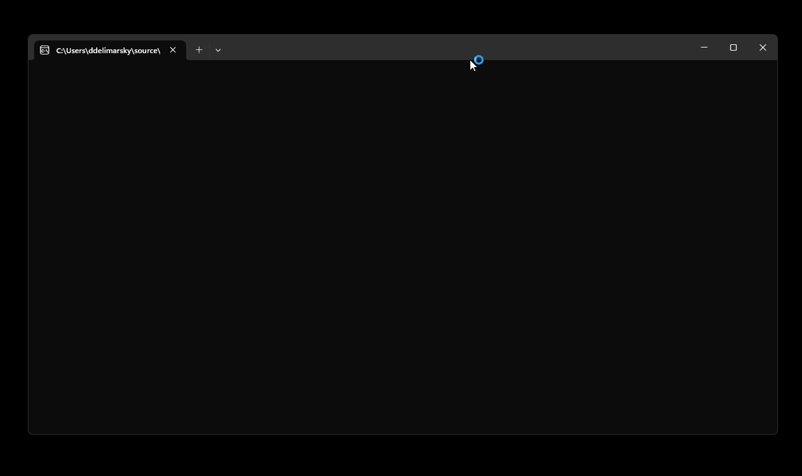
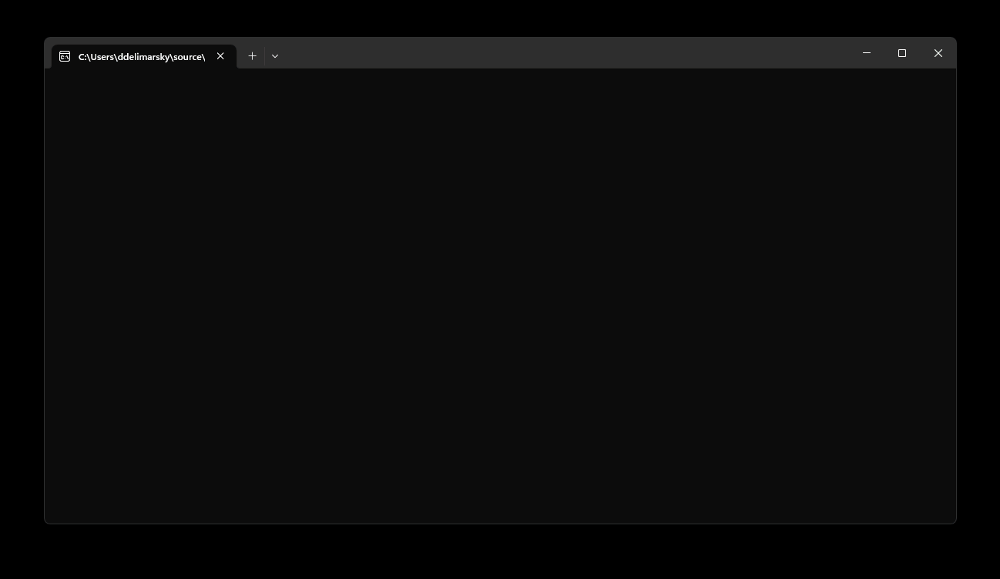

# Using MSAL.NET with Web Account Manager (WAM)

MSAL is able to call Web Account Manager (WAM), a Windows component that ships with the OS. This component acts as an authentication broker allowing the users of your app to benefit from integration with accounts known to Windows, such as the account you signed into your Windows session.

>[!NOTE]
>WAM is available on Windows 10 and above, as well as Windows Server 2019 and above. MSAL will automatically fallback to a browser if WAM cannot be used.

## What is a broker

An authentication broker is an application that runs on a user’s machine that manages the authentication handshakes and token maintenance for connected accounts. The Windows operating system uses the Web Account Manager (WAM) as its authentication broker. It has many benefits for developers and customers alike, including:

- **Enhanced security.** Many security enhancements will be delivered with the broker, without needing to update the application logic.
- **Feature support.** With the help of the broker developers can access rich OS and service capabilities such as Windows Hello, conditional access policies, and FIDO keys without writing extra scaffolding code.
- **System integration.** Applications that use the broker plug-and-play with the built-in account picker, allowing the user to quickly pick an existing account instead of reentering the same credentials over and over.
- **Token Protection.** WAM ensures that the refersh tokens are device bound and [enables apps](../../advanced/proof-of-possession-tokens.md) to acquire device bound access tokens. See [Token Protection](https://learn.microsoft.com/azure/active-directory/conditional-access/concept-token-protection)

## Enabling WAM

> [!IMPORTANT]
> Use MSAL.NET 4.52.0 or higher to get broker support.

WAM support is split across two packages:

- [Microsoft.Identity.Client](https://www.nuget.org/packages/Microsoft.Identity.Client/) (i.e., MSAL) - core library for token acquisition.
- [Microsoft.Identity.Client.Broker](https://www.nuget.org/packages/Microsoft.Identity.Client.Broker/) - adds support for authentication with the broker.

>[!NOTE]
>For migration purposes, and if you have a .NET 6, .NET Core, or a .NET Standard application that needs to use _both_ WAM and the [embedded browser](/azure/active-directory/develop/msal-net-web-browsers#embedded-vs-system-web-ui), you will also need to use the [Microsoft.Identity.Client.Desktop](https://www.nuget.org/packages/Microsoft.Identity.Client.Desktop/) package. Once added, developers can use [`WithWindowsDesktopFeatures`](xref:Microsoft.Identity.Client.Desktop.DesktopExtensions.WithWindowsDesktopFeatures*) when setting up their public client application.

After referencing the relevant packages, call [`WithBroker(BrokerOptions)`](xref:Microsoft.Identity.Client.Desktop.WamExtension.WithBroker*) with broker configuration options and [a window handle](#parent-window-handles) that the broker will be bound to.

```csharp
var scopes = new[] { "User.Read" };

BrokerOptions options = new BrokerOptions(BrokerOptions.OperatingSystems.Windows);
options.Title = "My Awesome Application";

IPublicClientApplication app =
    PublicClientApplicationBuilder.Create("YOUR_CLIENT_ID")
    .WithDefaultRedirectUri()
    .WithParentActivityOrWindow(GetConsoleOrTerminalWindow)
    .WithBroker(options)
    .Build();

AuthenticationResult result = null;

// Try to use the previously signed-in account from the cache
IEnumerable<IAccount> accounts = await app.GetAccountsAsync();
IAccount existingAccount = accounts.FirstOrDefault();

try
{    
    if (existingAccount != null)
    {
        result = await app.AcquireTokenSilent(scopes, existingAccount).ExecuteAsync();
    }
    // Next, try to sign in silently with the account that the user is signed into Windows
    else
    {    
        result = await app.AcquireTokenSilent(scopes, PublicClientApplication.OperatingSystemAccount)
                            .ExecuteAsync();
    }
}
// Can't get a token silently, go interactive
catch (MsalUiRequiredException ex)
{
    result = await app.AcquireTokenInteractive(scopes).ExecuteAsync();
}

```

When using the broker, if the [authority](/azure/active-directory/develop/msal-client-application-configuration#authority) used is targeting Azure AD as well as personal Microsoft accounts, the user will first be prompted to select an account using the built-in system account picker.



If the configuration is set on a per-tenant basis by using [`WithTenantId`](xref:Microsoft.Identity.Client.AbstractApplicationBuilder`1.WithTenantId*) or if the authority is set to an [audience](xref:Microsoft.Identity.Client.AadAuthorityAudience) that _does not_ include personal Microsoft accounts, the native Windows account picker will not be shown and instead the user will be prompted with a generic Microsoft authentication prompt.



Once the account is added or selected, the user will be prompted for additional consent if they have never used the application before or the application requires additional permissions.

>[!NOTE]
>No changes are required for UWP applications. Because the platform does not support the updated broker, existing applications will continue to use the legacy WAM implementation.

## Parent window handles

To use the broker, it is now required to provide the window handle to which the WAM modal dialog be parented using [`WithParentActivityOrWindow`](xref:Microsoft.Identity.Client.PublicClientApplicationBuilder.WithParentActivityOrWindow*) APIs. The window handle must be provided by the developer because it's not feasible for MSAL itself to infer the parent window and in the past this has led to bad user experiences where the authentication window was hidden behind the application window.

For UI apps, such as those using Windows Forms, Windows Presentation Foundation (WPF), or WinUI3, see [Retrieve a window handle (HWND)](/windows/apps/develop/ui-input/retrieve-hwnd).

For console applications, you can use code like the snippet below.

```csharp
enum GetAncestorFlags
{   
    GetParent = 1,
    GetRoot = 2,
    /// <summary>
    /// Retrieves the owned root window by walking the chain of parent and owner windows returned by GetParent.
    /// </summary>
    GetRootOwner = 3
}

/// <summary>
/// Retrieves the handle to the ancestor of the specified window.
/// </summary>
/// <param name="hwnd">A handle to the window whose ancestor is to be retrieved.
/// If this parameter is the desktop window, the function returns NULL. </param>
/// <param name="flags">The ancestor to be retrieved.</param>
/// <returns>The return value is the handle to the ancestor window.</returns>
[DllImport("user32.dll", ExactSpelling = true)]
static extern IntPtr GetAncestor(IntPtr hwnd, GetAncestorFlags flags);

[DllImport("kernel32.dll")]
static extern IntPtr GetConsoleWindow();

// This is your window handle!
public IntPtr GetConsoleOrTerminalWindow()
{
    IntPtr consoleHandle = GetConsoleWindow();
    IntPtr handle = GetAncestor(consoleHandle, GetAncestorFlags.GetRootOwner );
    
    return handle;
}
```

## Proof-of-Possession access tokens

The WAM broker allows acquiring PoP tokens for public client flows. See [Proof-of-Possession tokens](../../advanced/proof-of-possession-tokens.md) for more details.

## Redirect URI

WAM redirect URIs do not need to be configured in MSAL, but they must be configured in the app registration. They should follow the pattern below:

```text
ms-appx-web://microsoft.aad.brokerplugin/{client_id}
```

>[!NOTE]
>When configuring the redirect URL in the Azure Portal, ensure that you're setting it in the **Mobile and desktop applications** section.

## Username/password flow

This flow, also known as Resource Owner Password Credentials (ROPC), is not recommended except in test scenarios or in scenarios where service principal access to a resource gives it too much access and you can only scope it down with user flows. When using WAM, [`AcquireTokenByUsernamePassword`](xref:Microsoft.Identity.Client.PublicClientApplication.AcquireTokenByUsernamePassword*) will let WAM manage the protocol and fetch tokens.

>[!WARNING]
>There are a few important considerations that you need to account for when using the ROPC flow. One of the main ones is that it **doesn't support personal Microsoft accounts** and **Azure AD accounts with enabled multi-factor authentication**. Check out [Microsoft identity platform and OAuth 2.0 Resource Owner Password Credentials](/azure/active-directory/develop/v2-oauth-ropc) for the full overview.

## WAM limitations

- Azure B2C and Active Directory Federation Services (ADFS) authorities aren't supported. MSAL will fall back to using a browser for user authentication.
- On Mac, Linux, and versions of Windows earlier than 10 or Windows Server 2019, MSAL will fall back to a browser.
- Updated WAM broker is not available on UWP due to Windows API limitations. UWP apps will use the legacy WAM implementation.

## Troubleshooting

### "MsalClientException (ErrCode 5376): At least one scope needs to be requested for this authentication flow." error message

This message indicates that you need to request at least one application scope (e.g. `user.read`) along with other OIDC scopes (`profile`, `email` or `offline_access`).

```csharp
var authResult = await pca.AcquireTokenInteractive(new[] { "user.read" })
                 .ExecuteAsync();
```

### Account picker does not show up

Sometimes a Windows update can unintentionally affect the account picker component, which shows the list of accounts in Windows and the option to add new accounts. The symptom is that the picker does not come up for a small number of users.

A possible workaround is to re-register the component. Run this script from the terminal with Administrator permissions:

```powershell
if (-not (Get-AppxPackage Microsoft.AccountsControl))
{ 
    Add-AppxPackage -Register "$env:windir\SystemApps\Microsoft.AccountsControl_cw5n1h2txyewy\AppxManifest.xml" -DisableDevelopmentMode -ForceApplicationShutdown 
}

Get-AppxPackage Microsoft.AccountsControl
```

### Connection issues

The application user sees an error message similar to `Please check your connection and try again`. If this issue occurs regularly, see the [troubleshooting guide for Office](/microsoft-365/troubleshoot/authentication/connection-issue-when-sign-in-office-2016), which also uses WAM.

### WAM error codes

Because WAM is a relatively new component, when errors occur we recommend logging data from [`AdditionalExceptionData`](xref:Microsoft.Identity.Client.MsalException.AdditionalExceptionData*). This can help pinpoint specific issues with the configuration or the WAM component. When you run into WAM issues, please [log a bug](https://github.com/AzureAD/microsoft-authentication-library-for-dotnet/issues) - this will help us ensure we address the problem in a timely manner.
