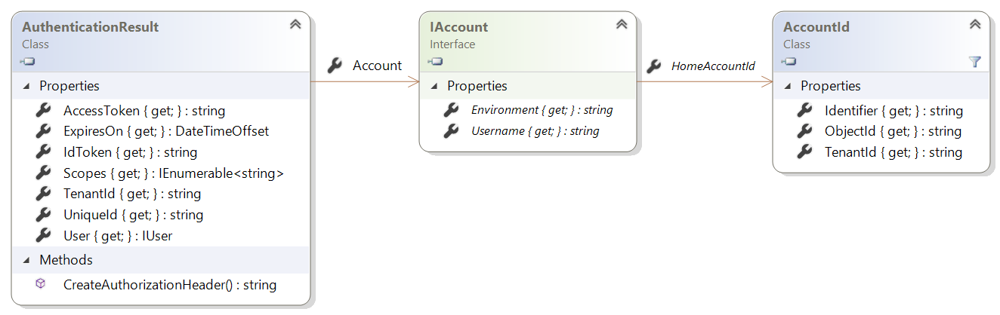

# Token acquisition

## Application types

As explained in [Scenarios](../getting-started/scenarios.md), there are many ways of acquiring a token with MSAL.NET. Some require interaction and others are completely transparent to the user. The approach used to acquire a token is different depending on whether the developer is building a public client (desktop or mobile) or a confidential client application (web app, web API, or daemon like a Windows service). Public clients generally require user interaction while confidential clients rely on pre-provisioned credentials, like certificates and secrets.

## Token caching

For both public and confidential client applications, MSAL.NET supports adding a token cache that preserves authentication and refresh tokens, as well as proactively refreshes those on an as-needed basis. For details, see [Token cache serialization in MSAL.NET](../how-to/token-cache-serialization.md).

In the case of Universal Windows Platform (UWP) applications, Xamarin for iOS, and Xamarin for Android, token cache serialization to an isolated storage is automatically provided by MSAL.NET and developers do not need to add any custom caching logic. For .NET desktop applications (.NET, .NET Framework, and .NET Core) the application needs to handle the token cache serialization and storage directly; however, helper classes are available to help simplify the process.

## Token acquisition methods

### Public client applications

#### Flows

- Will often [acquire token interactively](./desktop-mobile/acquiring-tokens-interactively.md), having the user sign-in.
- It's also possible for a desktop application running on a Windows machine joined to a domain or to Microsoft Entra ID to [use Integrated Windows Authentication (IWA/Kerberos)](./desktop-mobile/integrated-windows-authentication.md) to acquire a token silently.
- For .NET Framework desktop applications, in limited scenarios it's possible to [get a token with a username and password](./desktop-mobile/username-password-authentication.md). Due to security considerations, this approach is not recommended.
- Applications running on devices which don't have a web browser, a token can be acquired with the help of the [device code flow](./desktop-mobile/device-code-flow.md), which provides the application user with a URL and a code. The user will subsequently go to a web browser on another device, enter the code, and sign in. The authenticating device will then poll Microsoft Entra ID services until it receives confirmation of a successful sign in and an access token.

#### Summary

The following table summarizes the ways available to acquire tokens in public client applications:

| Operating system      | Platform        | App type | [Interactive](./desktop-mobile/acquiring-tokens-interactively.md) | [IWA](./desktop-mobile/integrated-windows-authentication.md) | [ROPC](./desktop-mobile/username-password-authentication.md) | [Device Code](./desktop-mobile/device-code-flow.md) |
|:----------------------|:----------------|:---------|:------------------------------------------------------------------|:-------------------------------------------------------------|:-------------------------------------------------------------|:----------------------------------------------------|
| Windows desktop	      | .NET            | Desktop (WPF, Windows Forms, Console) | Y | Y | Y | Y |
| Windows 10	          | UWP	            | Store app	                            | Y	| Y	| 	|   |
| Android	              | Xamarin Android	| Mobile	                              | Y	| 	| Y	|   |
| iOS                   | Xamarin iOS	    | Mobile	                              | Y	| 	| 	| Y |
| macOS, Linux, Windows	| .NET Core 	    | Console	                              | N/A see [1](/azure/active-directory/develop/msal-net-web-browsers)	| Y	| Y	| Y |

### Confidential client applications

#### Flows

- Acquire token **for the application itself**, not for a user, using [client credentials](./web-apps-apis/client-credential-flows.md). This can be used for syncing tools, or tools which process users in general, not a particular user. 
- In the case of Web APIs calling and API on behalf of the user, using the [On Behalf Of flow](./web-apps-apis/on-behalf-of-flow.md) and still identifying the application itself with client credentials to acquire a token based on some User assertion (SAML for instance, or a JWT token). This can be used for applications which need to access resources of a particular user in service to service calls.
- **For Web apps**, acquire tokens [by authorization code](./web-apps-apis/authorization-codes.md) after letting the user sign-in through the authorization request URL. This is typically the mechanism used by an OpenID Connect application, which lets the user sign-in using OpenID Connect, but then wants to access Web APIs on behalf of this particular user.

#### Summary

The following table summarizes the ways available to acquire tokens in confidential client applications depending on the Operating system, and therefore the chosen platform, and the kind of application.

Operating System | Library Platform | Kind of App | [Client Credential](./web-apps-apis/client-credential-flows.md) | [On behalf of](./web-apps-apis/on-behalf-of-flow.md) | [Auth Code](./web-apps-apis/authorization-codes.md)
 -- | -------- | --- | ----------  | --- | ---
Windows |  <br/> .NET Framework |  | Y | | Y
Windows, MacOS, Linux |  <br/> ASP.NET Core  |  | Y | | Y |
Windows |  <br/> .NET Framework |  | Y | Y |
Windows, MacOS, Linux | <br/> ASP.NET Core |  | Y | Y |
Windows |  <br/> .NET Framework |  <br/> (windows service) | Y | |
Windows, MacOS, Linux |  <br/> .NET Core | | Y | |

### Pattern to acquire tokens in MSAL.NET

All the Acquire Token methods in MSAL.NET have the following pattern:

- From the application, you call the AcquireToken*XXX* method corresponding to the flow you want to use, passing the mandatory parameters for this flow (in general flow)
- This returns a command builder, on which you can add optional parameters using .With*YYY* methods
- Then you call ExecuteAsync() to get your authentication result.

Here is the pattern:

```csharp
AuthenticationResult result = app.AcquireTokenXXX(mandatory-parameters)
 .WithYYYParameter(optional-parameter)
 .ExecuteAsync();
```

## `AuthenticationResult` properties in MSAL.NET

In all cases above, methods to acquire tokens return an `AuthenticationResult` (or in the case of the async methods a `Task<AuthenticationResult>`.

In MSAL.NET, AuthenticationResult exposes:

- `AccessToken` for the Web API to access resources. This is a string, usually a base64 encoded JWT but the client should never look inside the access token. The format isn't guaranteed to remain stable, and it can be encrypted for the resource. People writing code depending on access token content on the client is one of the biggest sources of errors and client logic breaks 
- `IdToken` for the user (this is a JWT)
- `ExpiresOn` tells the date/time when the token expires
- `TenantId` contains the tenant in which the user was found. Note that in the case of guest users (Microsoft Entra B2B scenarios), the TenantId is the guest tenant, not the unique tenant.
When the token is delivered in the name of a user, `AuthenticationResult` also contains information about this user. For confidential client flows where tokens are requested with no user (for the application), this User information is null.
- The `Scopes` for which the token was issued (See [Scopes not resources](/azure/active-directory/develop/msal-net-differences-adal-net))
- The unique Id for the user.

## `IAccount`

MSAL.NET defines the notion of Account (through the `IAccount` interface). This breaking change provides the right semantics: the fact that the same user can have several accounts, in different Microsoft Entra directories. Also MSAL.NET provides better information in the case of guest scenarios, as home account information is provided.
The following diagram shows the structure of the `IAccount` interface:



The `AccountId` class identifies an account in a specific tenant. It has the following properties:

Property | Description
-------- | -----------
`TenantId` | A string representation for a GUID, which is the ID of the tenant where the account resides
`ObjectId` | A string representation for a GUID which is the ID of the user who owns the account in the tenant
`Identifier` | Unique identifier for the account (this is the concatenation of `ObjectId` and `TenantId` separated by a comma and are not base64 encoded)

The `IAccount` interface represents information about a single account. The same user can be present in different tenants, that is, a user can have multiple accounts. Its members are:

Property | Description
--- | ----
`Username` | A string containing the displayable value in UserPrincipalName (UPN) format, for example, john.doe@contoso.com. This can be null, whereas the HomeAccountId and HomeAccountId.Identifier won’t be null. This property replaces the `DisplayableId` property of `IUser` in previous versions of MSAL.NET.
`Environment` | A string containing the identity provider for this account, for example, `login.microsoftonline.com`. This property replaces the `IdentityProvider` property of `IUser`, except that `IdentityProvider` also had information about the tenant (in addition to the cloud environment), whereas here this is only the host.
`HomeAccountId` | AccountId of the home account for the user. This uniquely identifies the user across Microsoft Entra tenants.
