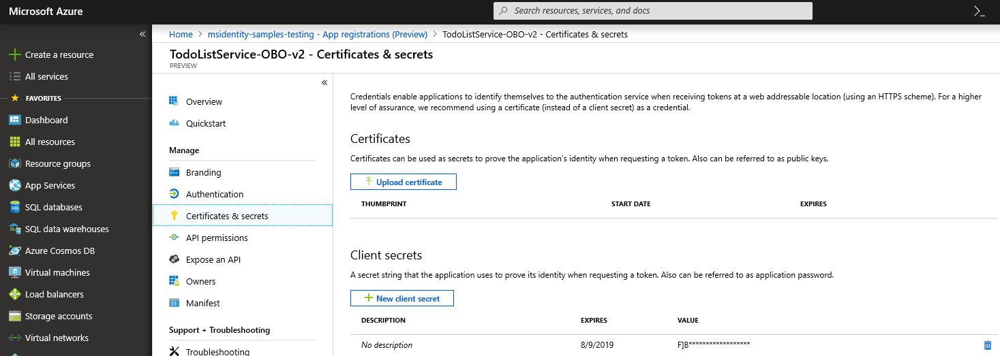

# Client credential flows

## Supported platforms

While MSAL.NET is a multi-framework library, Confidential Client flows are not available on mobile and client-facing platforms (e.g., UWP, Xamarin.iOS, and Xamarin.Android) since there is no secure way of deploying a secret with an application.

## Supported client credentials

MSAL.NET supports two types of client credentials, which must be registered in the Microsoft Entra portal:

- Application secrets (_not recommended for production scenarios_).
- Certificates.

For advanced scenarios, two other types credentials can be used:

- Signed client assertions.
- Certificate and additional claims to be sent.

For additional details, refer to the [Confidential client assertions](/azure/active-directory/develop/msal-net-client-assertions) document.

### Example usage

```csharp
// This object will cache tokens in-memory - keep it as a singleton
var singletonApp = ConfidentialClientApplicationBuilder.Create(config.ClientId)
        // Don't specify authority here, we'll do it on the request 
        .WithCertificate(certificate) // or .WithClientSecret(secret)
        .Build();

// If instead you need to re-create the ConfidentialClientApplication on each request, you MUST customize 
// the cache serialization (see below)

// When making the request, specify the tenant-based authority
var authResult = await app.AcquireTokenForClient(scopes: new [] {  "some_app_id_uri/.default"})        // Uses the token cache automatically, which is optimized for multi-tenant access
        .WithAuthority(AzureCloudInstance.AzurePublic, "{tenantID}")  // Do not use "common" or "organizations"!
        .ExecuteAsync();
```

>[!IMPORTANT]
>Do not use `common` or `organizations` authority for client credential flows.

## Custom cache serialization

If your service is multi-tenant (i.e., it needs tokens for a resource that is in a different tenant), see [MSAL for client credential flow in multi-tenant services](../../advanced/client-credential-multi-tenant.md).

You can serialize the token cache to a location of your choice (e.g., in-memory or through a distributed system like Redis). You would do this to:

- Share the token cache between several instances of [`ConfidentialClientApplication`](xref:Microsoft.Identity.Client.ConfidentialClientApplication).
- Persist the token cache to share it between different machines.

Please see [distributed cache implementations](https://github.com/AzureAD/microsoft-identity-web/tree/master/src/Microsoft.Identity.Web.TokenCache/Distributed) and [binding the token cache](/azure/active-directory/develop/msal-net-token-cache-serialization) for additional implementation details.

Check our [sample](https://github.com/Azure-Samples/active-directory-dotnet-v1-to-v2/blob/b48c10180665260a1aec78a9acf7d1b1ff97e5ba/ConfidentialClientTokenCache/Program.cs) to see how token cache serialization works.

## Ensuring high availability of your applications

### Service is running out of memory

See [Using MSAL.NET for client credential flow in multi-tenant services](../../advanced/client-credential-multi-tenant.md) for an in-depth overview of the multi-tenant architecture with MSAL.NET.

Make sure to provision enough RAM on the machines running your service or use a distributed cache. A single token is a a few kilobytes (KB) in size, and one token is stored for each tenant with which the application interacts.

### Avoid requesting new tokens on each machine of a distributed service

Use a distributed cache, like [Redis](https://redis.io/).

### Monitoring cache hit rates

The authentication result object can tell you if the token comes from the cache:

```csharp
authResult.AuthenticationResultMetadata.TokenSource == TokenSource.Cache
```

### Handling "loop detected" errors

You are calling Microsoft Entra ID for a token too often and the service is throttling you. To mitigate this issue, you need to use a cache - either the in-memory one (as per the sample above) or a persisted one.

### High latency for token acquisition

Please ensure you have a high token cache hit rate. The in-memory cache is optimized for searching through tokens that come from different client IDs or different tenant IDs. It is not optimized for storing tokens with different scopes. You need to use a different cache key that includes the scope. See [Performance testing](../../advanced/performance-testing.md) for additional recommendations.

## Configuring application secrets or certificates with Microsoft Entra ID

You can register your application secrets either through the interactive experience in the [Azure portal](https://portal.azure.com/), or using command-line tools like PowerShell.

### Registering client secrets using the application registration portal

The management of client credentials happens in the **Certificates & secrets** page for a registered application in the Microsoft Entra portal:



### Registering client secrets using PowerShell

The [`active-directory-dotnetcore-daemon-v2`](https://github.com/Azure-Samples/active-directory-dotnetcore-daemon-v2) sample shows how to register an application secret or a certificate with a Microsoft Entra application:

- Register an application secret: [`AppCreationScripts/Configure.ps1`](https://github.com/Azure-Samples/active-directory-dotnetcore-daemon-v2/blob/5199032b352a912e7cc0fce143f81664ba1a8c26/AppCreationScripts/Configure.ps1#L190)
- Register a certificate with the application: [`AppCreationScripts-withCert/Configure.ps1`](https://github.com/Azure-Samples/active-directory-dotnetcore-daemon-v2/blob/5199032b352a912e7cc0fce143f81664ba1a8c26/AppCreationScripts-withCert/Configure.ps1#L162-L178)

## Using client credentials

In MSAL.NET, client credentials are passed as a parameter during <xref:Microsoft.Identity.Client.ConfidentialClientApplication> instantiation. Once the confidential client application is constructed, acquiring the token requires calling <xref:Microsoft.Identity.Client.ConfidentialClientApplication.AcquireTokenForClient(System.Collections.Generic.IEnumerable{System.String})> or one of its overloads, passing the scope and indicating whether a token refresh is required.

## Client assertions

Instead of a client secret or a certificate, the confidential client application can also prove its identity using client assertions. This scenario is outlined in detail in the [Confidential client assertions](../web-apps-apis/confidential-client-assertions.md) document.

## Remarks

### `AcquireTokenForClient` uses the application token cache

[AcquireTokenForClient](xref:Microsoft.Identity.Client.ConfidentialClientApplication.AcquireTokenForClient(System.Collections.Generic.IEnumerable{System.String})) uses the **application** token cache (not the user token cache).

Don't call [AcquireTokenSilent](xref:Microsoft.Identity.Client.ClientApplicationBase.AcquireTokenSilent(System.Collections.Generic.IEnumerable{System.String},Microsoft.Identity.Client.IAccount)) before calling [AcquireTokenForClient](xref:Microsoft.Identity.Client.ConfidentialClientApplication.AcquireTokenForClient(System.Collections.Generic.IEnumerable{System.String})) as [AcquireTokenSilent](xref:Microsoft.Identity.Client.ClientApplicationBase.AcquireTokenSilent(System.Collections.Generic.IEnumerable{System.String},Microsoft.Identity.Client.IAccount)) uses the **user** token cache.

[AcquireTokenForClient](xref:Microsoft.Identity.Client.ConfidentialClientApplication.AcquireTokenForClient(System.Collections.Generic.IEnumerable{System.String})) checks the **application** token cache itself and updates it.

See [Token cache types](../../how-to/token-cache-serialization.md#token-cache-types) for details on differences between application and user token caches.

### Scopes to request

The scope to request for a client credential flow is the name of the resource followed by `/.default`. This notation tells Microsoft Entra ID to use **application level permissions** declared statically during the application registration. The API permissions must be granted by a tenant administrator.

This configuration can look as such:

```csharp
ResourceId = "someAppIDURI";
var scopes = new [] {  ResourceId+"/.default"};

var result = app.AcquireTokenForClient(scopes);
```

### No need for reply URL if app is a daemon

If your confidential client application uses **only** the client credentials flow, you don't need to specify a reply URL in the constructor.

## Samples

| Sample | Platform | Description |
|:-------|:---------|:------------|
| [active-directory-dotnetcore-daemon-v2](https://github.com/Azure-Samples/active-directory-dotnetcore-daemon-v2) | .NET        | <p>A simple .NET application that displays the users of a tenant querying Microsoft Graph using the identity of the application, instead of on behalf of a user.</p>  <p>The sample also illustrates the variation with certificates.</p> 
| [active-directory-dotnet-daemon-v2](https://github.com/Azure-Samples/active-directory-dotnet-daemon-v2)         | ASP.NET MVC | <p>A web application that syncs data from Microsoft Graph using the identity of the application, instead of on behalf of a user.</p>

## More info

You can find more information in the [protocol documentation](/azure/active-directory/develop/v2-oauth2-client-creds-grant-flow).
