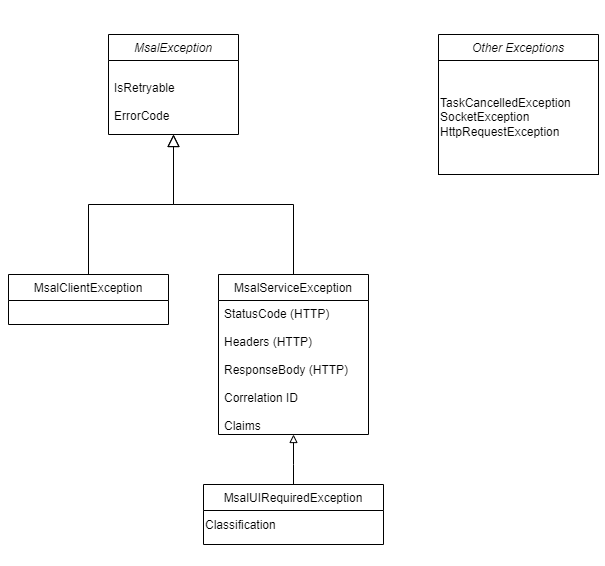

# Exceptions in MSAL.NET

Exceptions in MSAL.NET are intended for app developers to troubleshoot and not for displaying to end-users. Exception messages are not localized.

## The different types of exceptions

| Exception                 | Description                                                                                                                                                                                                    |
|---------------------------|----------------------------------------------------------------------------------------------------------------------------------------------------------------------------------------------------------------|
| `MsalException`           | Base class for MSAL exceptions.                                                                                                                                                                                |
| `MsalClientException`     | Errors which occur in the library itself, for example an incomplete configuration.                                                                                                                             |
| `MsalServiceException`    | Represents errors transmitted by the token provider (Microsoft Entra ID). See [Microsoft Entra errors](/azure/active-directory/develop/reference-aadsts-error-codes#handling-error-codes-in-your-application). Service unavailable errors (e.g. HTTP 500), indicating a problem with the service, have the error code `service_not_available` |
| `MsalUiRequiredException` | Special Microsoft Entra error which indicates that the user must interactively login.                                                                                                                                      |

No other exception is caught by MSAL. Any network issues, cancellations etc. are bubbled up to the application.

MSAL throws `MsalClientException` for things that go wrong inside the library (e.g. bad configuration) and [`MsalServiceException`](xref:Microsoft.Identity.Client.MsalServiceException) for things that go wrong service side or in the broker (e.g. a secret expired).

### Common exceptions

1. User cancelled authentication (public client only)

When calling `AcquireTokenInteractive`, a browser or the broker is invoked to handle user interaction. If the user closes this process or if they hit the browser back button, MSAL generates an [`MsalClientException`](xref:Microsoft.Identity.Client.MsalClientException) with the error code `authentication_canceled` (`MsalError.AuthenticationCanceledError`).

On Android, this exception can also occur if a [browser with tabs](/azure/active-directory/develop/msal-net-system-browser-android-considerations) is not available.

2. HTTP Exceptions

Developers are expected to implement their own retry policies when calling MSAL. MSAL makes HTTP calls to the Microsoft Entra service, and occasional failures can occur, for example the network can go down or the server is overloaded. HTTP 5xx status code responses are retried once.

### Exception types

When processing exceptions, you can use the exception type itself and the `ErrorCode` member to distinguish between exceptions. The values of `ErrorCode` are constants of [`MsalError`](xref:Microsoft.Identity.Client.MsalError).

You can also have a look at the fields of [`MsalClientException`](xref:Microsoft.Identity.Client.MsalClientException), [`MsalServiceException`](xref:Microsoft.Identity.Client.MsalServiceException), [`MsalUiRequiredException`](xref:Microsoft.Identity.Client.MsalUiRequiredException).

In the case of [`MsalServiceException`](xref:Microsoft.Identity.Client.MsalServiceException), the error might contain a code which you can find in [Authentication and authorization error codes](/azure/active-directory/develop/reference-aadsts-error-codes).

#### MsalUiRequiredException

The "UI Required" is a specialization of `MsalServiceException` named `MsalUiRequiredException`. This means you have attempted to use a non-interactive method of acquiring a token (e.g. AcquireTokenSilent), but MSAL could not do it silently. this can be because:

- you need to sign-in
- you need to consent
- you need to go through a multi-factor authentication experience.

To remediate, call an AcquireToken* method that prompts the user, for example `AcquireTokenInteractive` in public clients, redirect the user to login in websites or respond with a 401 in a web API.

### Continuous Access Evaluation

See [How to use Continuous Access Evaluation enabled APIs in your applications](/entra/identity-platform/app-resilience-continuous-access-evaluation).

### Handling Claim challenge exceptions in MSAL.NET

In some cases, when the Microsoft Entra tenant admin has enabled conditional access policies, your application will need to handle claim challenge exceptions. This will appear as an `MsalServiceException` which `Claims` property won't be empty. For instance if the conditional access policy is to have a managed device (Intune) the error will be something like `AADSTS53000: Your device is required to be managed to access this resource` or something similar.

To handle the claim challenge, you will need to use the <xref:Microsoft.Identity.Client.AbstractAcquireTokenParameterBuilder%601.WithClaims(System.String)> method.

### Retry policies

See [Retry-Policy](../exceptions/retry-policy.md)
