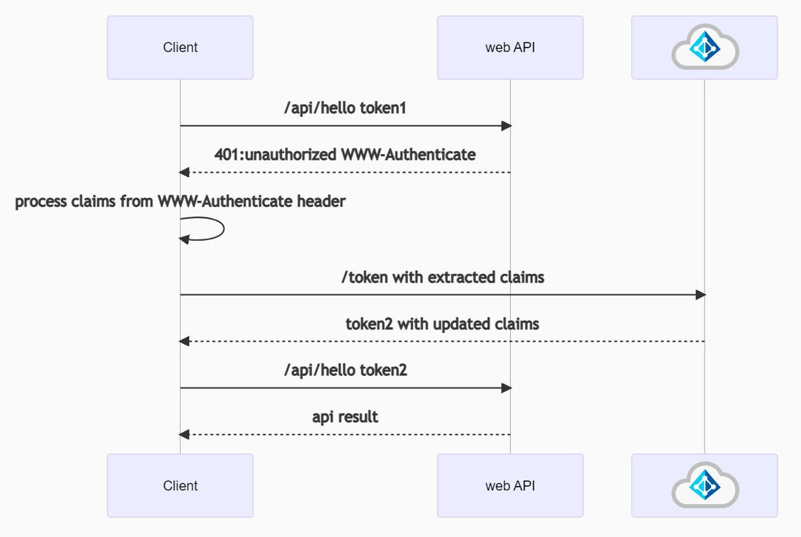

# Extract authentication parameters from WWW-Authenticate headers

## Scenarios

### Unauthenticated calls to a protected web API

A protected web API will send a `HTTP 401 Unauthorized` error when an incoming request is not fully authorized to access the resource. The response may also include a `WWW-Authenticate` header with a challenge - extra information specifying how to get a correct access token to this resource. The resource can return this error response when the request either has not included an authorization token or the token is invalid. The web API also returns a challenge if the access token is out-of-date (for example, the user needs to login again with multi-factor authentication). Given that web APIs are unable to have interaction with the user, they need to propagate back the request to the client using the information in a `WWW-Authenticate` header. The client app is responsible for extracting these claims and including them in the token request to the identity provider. This should trigger the UI for the user to re-login. Afterwards, the identity provider will return an up-to-date access token which should be included in a request to the web API.



To see an example, navigate to `https://graph.microsoft.com/v1.0/me`. Microsoft Graph will return an `HTTP 401 Unauthorized` error and the `WWW-Authenticate` header will specify the authorization URI where to get the token and the client ID of this resource.

  ```text
  HTTP 401; Unauthorized
  WWW-Authenticate: Bearer realm="", authorization_uri="https://login.microsoftonline.com/common/oauth2/authorize", client_id="00000003-0000-0000-c000-000000000000"
  ```

Navigate to `https://yourVault.vault.azure.net/secrets/CertName/CertVersion`, to receive a header that looks like the following:

  ```text
  HTTP 401; Unauthorized
  WWW-Authenticate: Bearer authorization="https://login.windows.net/yourTenantId", resource="https://vault.azure.net"
  ```

### Continuous Access Evaluation

[Continuous Access Evaluation](/azure/active-directory/conditional-access/concept-continuous-access-evaluation)(CAE) allows resources to continuously keep track of the user and app changes in Microsoft Entra ID and update its policies in a timely manner. Based on the changed policies, CAE-enabled web APIs will send a `WWW-Authenticate` header with the appropriate claims challenge. For details, see [How to use Continuous Access Evaluation enabled APIs in your applications](/azure/active-directory/develop/app-resilience-continuous-access-evaluation). The `WWW-Authenticate` header will have the following form:

```text
HTTP 401; Unauthorized
WWW-Authenticate=Bearer
  authorization_uri="https://login.windows.net/common/oauth2/authorize",
  error="insufficient_claims",
  claims="eyJhY2Nlc3NfdG9rZW4iOnsibmJmIjp7ImVzc2VudGlhbCI6dHJ1ZSwgInZhbHVlIjoiMTYwNDEwNjY1MSJ9fX0="
```

### Conditional Access authentication context

Conditional Access authentication context (CA auth context) allows you to apply granular policies to sensitive data and actions instead of just at the app level. CA auth context also relies on web APIs sending back a `WWW-Authenticate` header. For details about CA auth context, see:

- [Developer guide to Conditional Access authentication context](/azure/active-directory/develop/developer-guide-conditional-access-authentication-context)
- [Code sample to use CA Auth context in a web API](https://github.com/Azure-Samples/ms-identity-ca-auth-context/blob/main/README.md)
- [Recorded session: Use Conditional Access Auth Context in your app for step-up authentication – May 2021](https://www.youtube.com/watch?v=_iO7CfoktTY)

The `WWW-Authenticate` header returned in a CA auth context scenario is similar to the one returned by CAE-enabled web APIs:

```text
HTTP 401; Unauthorized
WWW-Authenticate=Bearer
  client_id="Resource GUID"
  authorization_uri="https://login.windows.net/common/oauth2/authorize",
  error="insufficient_claims",
  claims="eyJhY2Nlc3NfdG9rZW4iOnsibmJmIjp7ImVzc2VudGlhbCI6dHJ1ZSwgInZhbHVlIjoiMTYwNDEwNjY1MSJ9fX0="
```

## Code examples

### MSAL.NET

To process the claims challenge, the client application will look for an `insufficient_claims` error in the `WWW-Authenticate` header and extract the `claims` property. If the claims value is Base64 encoded, it must be decoded. The claims challenge should be in a JSON format. Lastly, pass this value into <xref:Microsoft.Identity.Client.AbstractAcquireTokenParameterBuilder%601.WithClaims(System.String)> when acquiring a token. MSAL.NET provides a <xref:Microsoft.Identity.Client.WwwAuthenticateParameters> class to help in extracting the claims.

When making an unauthenticated call to a protected web API, call <xref:Microsoft.Identity.Client.WwwAuthenticateParameters.CreateFromAuthenticationResponseAsync%2A> passing in the URI of the resource. MSAL will make a request to the resource, extract, and return the values in the `WWW-Authenticate` header.

```csharp
WwwAuthenticateParameters parameters = 
    await WwwAuthenticateParameters.CreateFromResourceResponseAsync("https://yourVault.vault.azure.net/secrets/secret/version");

IConfidentialClientApplication app = ConfidentialClientApplicationBuilder.Create(clientId)
    .WithAuthority(parameters.Authority)     
    .Build();

// For details about token caching, see https://aka.ms/msal-net-token-cache-serialization .
app.AppTokenCache.SetCacheOptions(CacheOptions.EnableSharedCacheOptions);

AuthenticationResult authenticationResult = await app.AcquireTokenForClient(new[] {"scope") // You should already know the scope in advance.
    .WithClaims(parameters.Claims)
    .ExecuteAsync();
```

When calling a web API which supports Conditional Access or Continuous Access Evaluation, use <xref:Microsoft.Identity.Client.WwwAuthenticateParameters.GetClaimChallengeFromResponseHeaders(System.Net.Http.Headers.HttpResponseHeaders,System.String)> to handle `HTTP 401 Unauthorized` responses.

```csharp
using HttpRequestMessage httpRequestMessage = new HttpRequestMessage(
        new HttpMethod(httpMethod),
        apiUrl);

httpRequestMessage.Headers.Add(
                    "Authorization",
                    authenticationResult.CreateAuthorizationHeader());

HttpResponseMessage httpResponse = await httpClient.SendAsync(httpRequestMessage).ConfigureAwait(false);

if (httpResponse.StatusCode == System.Net.HttpStatusCode.Unauthorized)
{
    string claims = WwwAuthenticateParameters.GetClaimChallengeFromResponseHeaders(httpResponse.Headers);
    // Acquire a new token with these claims
    // Call the web API again with the new token
}

// Handle a successful web API response.
```

### Microsoft.Identity.Web

In web APIs that use [Microsoft.Identity.Web](/entra/msal/dotnet/microsoft-identity-web/), use <xref:Microsoft.Identity.Web.ITokenAcquisition.ReplyForbiddenWithWwwAuthenticateHeader(System.Collections.Generic.IEnumerable{System.String},Microsoft.Identity.Client.MsalUiRequiredException,Microsoft.AspNetCore.Http.HttpResponse)> method to send back an `HTTP 401 Unauthorized` response with a `WWW-Authenticate` header.

Information included by Microsoft.Identity.Web (including non-standard properties):

- Consent URL (to help multi-tenant web API developers to provide a link that the tenant users or admins can use to consent for the web API to be installed in their tenant)
- Claims (in the case of a claims challenge)
- Scopes for the resource.
- `ProposedAction` (i.e. "consent")

## See also

- The spec is available in a [related GitHub issue](https://github.com/AzureAD/microsoft-authentication-library-for-dotnet/issues/2679).
- This [pull request](https://github.com/Azure-Samples/active-directory-aspnetcore-webapp-openidconnect-v2/pull/512) shows how the API was used for CAE.
