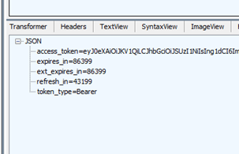

# High availability considerations in MSAL.NET

For client credentials flow, see the [Client credentials flows](..//acquiring-tokens/web-apps-apis/client-credential-flows.md#ensuring-high-availability-of-your-applications) documentation first.

## Use a higher level API

MSAL is a lower level API. If you are writing a new app, consider using the higher level [`Microsoft.Identitity.Web`](https://github.com/AzureAD/microsoft-identity-web) which provides out of the box integration with ASP.NET Core and ASP.NET Classic.

## Use the latest MSAL

Use the latest MSAL to get the bug fixes and performance improvements. [Semantic versioning](https://semver.org/) rules are followed.

You also want to check if you should use Microsoft Identity Web, a higher level library for web apps and web APIs, which does a lot of what is described below for your. See [Choosing a version of MSAL.NET](../getting-started/choosing-msal-dotnet.md), which proposes a decision tree to choose the best solution depending on your platform and constraints.

## Use the token cache

**Default behaviour:** MSAL caches the tokens in memory. Each `ConfidentialClientApplication` instance has its own internal token cache. In-memory cache can be lost, for example, if the object instance is disposed or the whole application is stopped.

**Recommendation:** All apps should persist their token caches. Web apps and Web APIs should use an L1 / L2 token cache where L2 is a distributed store like Redis to handle scale. Desktop apps should use [a proper token cache serialization strategy](/azure/active-directory/develop/msal-net-token-cache-serialization?tabs=desktop).

>[!NOTE]
>If you use Microsoft.Identity.Web, you don't need to worry about the cache as it implements the right cache behavior out-of-the-box. If you don't use Microsoft.Identity.Web but are building a web app or web API, you'd want to consider an [hybrid approach](../getting-started/choosing-msal-dotnet.md#when-do-you-use-the-hybrid-model-msalnet-and-microsoft-identity-web)

**Default behaviour:** MSAL maintains a secondary ADAL token cache for migration scenarios between ADAL and MSAL. ADAL cache operations are very slow.
**Recommendation:** Disable ADAL cache if you are not interested in migrating from ADAL. This will make a **BIG** perf improvement - see perf measurements [here](https://github.com/AzureAD/microsoft-authentication-library-for-dotnet/pull/2309).

Add [`WithLegacyCacheCompatibility(false)`](xref:Microsoft.Identity.Client.AbstractApplicationBuilder`1.WithLegacyCacheCompatibility*) when constructing your app to disable ADAL caching.

## Add monitoring around MSAL operations

MSAL exposes important metrics as part of [AuthenticationResult.AuthenticationResultMetadata](xref:Microsoft.Identity.Client.AuthenticationResult.AuthenticationResultMetadata*) object:

| Metric       | Meaning     | When to trigger an alarm?    |
| :-------------: | :----------: | :-----------: |
|  `DurationTotalInMs`| Total time spent in MSAL, including network calls and cache   | Alarm on overall high latency (> 1 s). Value depends on token source. From the cache: one cache access. From Microsoft Entra ID: two cache accesses + one HTTP call. First ever call (per-process) will take longer because of one extra HTTP call. |
|  `DurationInCacheInMs` | Time spent loading or saving the token cache, which is customized by the app developer (for example, save to Redis).| Alarm on spikes. |
|  `DurationInHttpInMs` | Time spent making HTTP calls to Microsoft Entra ID.  | Alarm on spikes.|
|  `TokenSource` | Indicates the source of the token. Tokens are retrieved from the cache much faster (for example, ~100 ms versus ~700 ms). Can be used to monitor and alarm the cache hit ratio. | Use with `DurationTotalInMs`. |
|  `CacheRefreshReason` | Specifies the reason for fetching the access token from the identity provider. See [possible values](xref:Microsoft.Identity.Client.CacheRefreshReason). | Use with `TokenSource`. |

## Logging

Listen to `Warning` and `Error` level messages coming from MSAL logs. These can be silent errors or strong recommendations to use a different config. 
It is not recommended to set `Verbose` logging in production, as it produces a lot of messages and it impacts perf.

Details about logging can be found in the [Logging in MSAL.NET](/azure/active-directory/develop/msal-logging-dotnet) guide.

## Retry Policy

**Default behaviour**: MSAL will retry failed 5xx requests once.

**Recommendation**:

- See our [retry policy documentation](./exceptions/retry-policy.md) for writing a retry policy with Polly

## One Confidential Client per session

It is recommended to use a new `ConfidentialClientApplication` on each session and to serialize in the same way - one token cache per session. This scales well and also increases security. The [official samples](/azure/active-directory/develop/sample-v2-code) show how to do this. You must [configure token caching](https://aka.ms/msal-net-token-cache-serialization) for this to work properly.

>[!NOTE]
>`Microsoft.Identity.Web` applies this approach - one confidential client app instance per request with enabled token caching.

## HttpClient

**Default behaviour**: MSAL-created `HttpClient` does not scale well for web sites/web API where we recommend to have a `ClientApplication` object for each user session.

**Recommendation**: Provide your own scalable HttpClientFactory. On .NET Core we recommend that you inject the [System.Net.Http.IHttpClientFactory](/aspnet/core/fundamentals/http-requests). This is described in more detail in the [Providing your own HttpClient, supporting HTTP proxies, and customization of user agent headers](httpclient.md) guide and in the [.NET documentation](/dotnet/api/system.net.http.httpclient#net-framework--mono)

## Proactive Token renewal

### Goal

Increase application availability by issuing longer lived access tokens and ensure they are refreshed earlier than their expiration date.

### Status quo

By default, Microsoft Entra ID issues access tokens with 1 hour expiration. If a Microsoft Entra outage occurs when a token needs to be refreshed, MSAL will fail. The failure propagates to the calling application and impacts availability.

### Process

To improve availability MSAL tries to ensure than an app always has fresh unexpired tokens. Microsoft Entra outages rarely take more than a few hours, so if MSAL can guarantee that a token always has at least a few hours of availability left, the application will not be impacted by the Microsoft Entra outage. 

To get long lived tokens, you must configure your tenant (note: internal Microsoft tenants are already configured). For client_credentials (service 2 service), this is enough. For user credentials, you must also configure CAE - /azure/active-directory/conditional-access/concept-continuous-access-evaluation.

When Microsoft Entra ID returns a long lived token, it includes a `refresh_in` field. It is generally set to half the expiration of the access token.

Note: From MSAL 4.37.0 and above, you can observe this value by inspecting the `AuthenticationResult.AuthenticationResultMetadata.RefreshOn`.

Additionally, you can configure a token lifetime of more than the default 1 hour, as described in [Configurable token lifetimes in the Microsoft identity platform (preview)](/azure/active-directory/develop/active-directory-configurable-token-lifetimes).

Whenever you make **requests for the same token**, i.e. whenever MSAL is able to serve a token from its cache, then MSAL will automatically check the `refresh_in` value. If it has elapsed, MSAL will issue a token request to Microsoft Entra ID in the background, but will return the existing, valid token to the application. In the unlikely event that the background refresh fails (e.g. Microsoft Entra outage), the app is not affected.

## Certificate Rotation

Certificates for the confidential client app must be rotated for security reasons (don't use secrets in prod!). There are several ways to handle certificate rotation, in order of the most preferred to the least:

1. Use managed identity

With [managed identity](./managed-identity.md), trust is established through hosting your app in Azure. There are not secrets to maintain and no certificates to rotate.

2. Use the `Microsoft.Identity.Web` certificate handling logic

In web apps and web APIs, use `Microsoft.Identity.Web`, a higher-level API over MSAL. It handles certificate rotation when the certificate is stored in Azure Key Vault and handles managed identity case as well.

Learn more in the [Certificates in Microsoft.Identity.Web](https://github.com/AzureAD/microsoft-identity-web/wiki/Certificates#getting-certificates-from-key-vault) guide.

This is the preferred solution for non-Microsoft internal services using ASP.NET Core.

3. (**Microsoft internal only**) Rely on Subject Name/Issuer certificates.

This mechanism allows Microsoft Entra ID to identify a certificate based on SN/I instead of a thumbprint (x5t). It is a stop-gap solution; there are no plans to make it available to non-Microsoft applications.

This is the preferred solution for Microsoft internal services which are not able to use managed identity.
