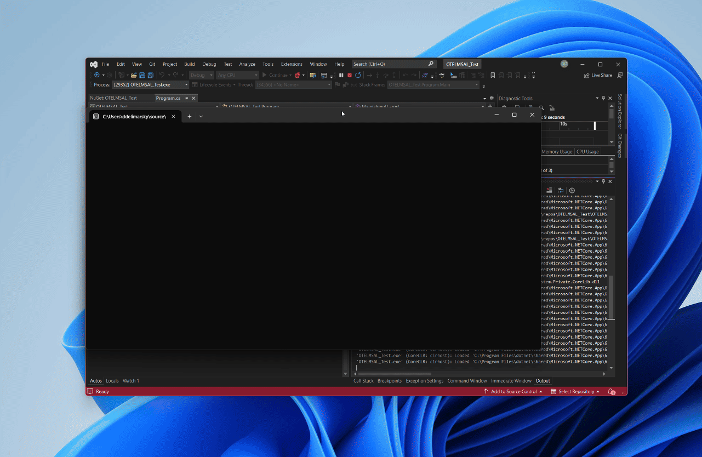

# Monitoring of applications using MSAL.NET

To ensure authentication services using MSAL.NET are running correctly, MSAL provides many ways to monitor its behavior so that issues can be identified and addressed before they occur in production. The incorrect use of MSAL (as it relates to token lifecycle and cache) doesn't lead to immediate failures, however sometimes they'll bubble up under high traffic scenarios after the app is in production for a period of time.

For example, if only one instance of a [confidential client application](/entra/identity-platform/msal-client-applications#public-client-and-confidential-client-authorization) is used and MSAL isn't configured to serialize the token cache, the cache will grow forever. Another issue arises when creating a new confidential client application and not utilizing the cache which will lead to issues such as throttling from the identity provider. For recommendations on how to utilize MSAL appropriately, see [High Availability](./high-availability.md).

## Logging

One of the tools MSAL provides to combat production issues is logging errors when MSAL isn't properly configured. It's critical to enable logging whenever possible to monitor logs for errors and help in the diagnosis of problematic events. See [Logging in MSAL.NET](./exceptions/msal-logging.md) for details.

The following errors will be logged in MSAL:

- When using an authority ending in `/common` or `/organizations` for client credential authentication (<xref:Microsoft.Identity.Client.ConfidentialClientApplication.AcquireTokenForClient(System.Collections.Generic.IEnumerable{System.String})>).
  - The current authority is targeting the `/common` or `/organizations` endpoint which is not recommended. See [Client credential flows](../acquiring-tokens/web-apps-apis/client-credential-flows.md) for more details.
- When the default internal token cache is used while using confidential client applications.
  - The default token cache provided by MSAL is not designed to be performant when used in confidential client applications. Refer to [Token cache serialization in MSAL.NET](/entra/msal/dotnet/how-to/token-cache-serialization?tabs=aspnetcore) for more details.

## Metrics

In addition to logging, MSAL exposes important metrics in <xref:Microsoft.Identity.Client.AuthenticationResult.AuthenticationResultMetadata?displayProperty=nameWithType>. See [Add monitoring around MSAL operations](high-availability.md#add-monitoring-around-msal-operations) for more details.

- `DurationTotalInMs` - total time spent in MSAL acquiring a token, including network calls and cache operations. Create an alert on overall high latency (more than 1 second). Note that the first ever token acquisition call usually makes an extra HTTP call.
- `DurationInCacheInMs` - time spent loading or saving the token cache, which is customized by the app developer (for example, save to Redis). Create an alert on spikes.

    > [!NOTE]
    > To understand how to customize token caching, see [Token cache serialization in MSAL.NET](/azure/active-directory/develop/msal-net-token-cache-serialization).

- `DurationInHttpInMs` - time spent making HTTP calls to the identity provider. Create an alert on spikes.
- `TokenSource`- indicates the source of the token - typically the cache or the identity provider. Tokens are retrieved from the cache much faster (for example, ~100 ms versus ~700 ms). This metric can be used to monitor the cache hit ratio.
- `CacheRefreshReason` - specifies the reason for fetching the access token from the identity provider. See <xref:Microsoft.Identity.Client.CacheRefreshReason>. Use in conjunction with `TokenSource`.
- `TokenEndpoint` - the actual token endpoint URI used to fetch the token. Useful to understand how MSAL resolves the tenant in silent calls and the region in regional calls.

    > [!NOTE]
    > Regionalization is available only to internal Microsoft applications.

- `RegionDetails` - the details about the region used to make call, such as the region used and any auto-detection error.

    > [!NOTE]
    > Regionalization is available only to internal Microsoft applications.

## OpenTelemetry

Starting with MSAL 4.58.0, the library supports [OpenTelemetry](https://opentelemetry.io/) - a set of APIs that enable instrumentation, generation, and collection of telemetry data in a consistent and standardized manner. To get started, ensure that you;

1. Install the latest version of [MSAL.NET](https://www.nuget.org/packages/Microsoft.Identity.Client).
1. Add the [OpenTelemetry](https://www.nuget.org/packages/OpenTelemetry#readme-body-tab) package dependency to your project.
1. Add an exporter dependency, that allows you to export logs, for example, the [Console exporter for OpenTelemetry.NET](https://www.nuget.org/packages/OpenTelemetry.Exporter.Console/1.7.0-alpha.1).

>[!NOTE]
>While the console exporter is a good start for local debugging and diagnostics, it's not the best choice for production-deployed applications. We recommend checking out the [official exporter documentation](https://opentelemetry.io/docs/instrumentation/net/exporters/) to learn more about available options. If you are hosting applications on Azure, you may consider ingesting OpenTelemetry data in [Azure Data Explorer](/azure/data-explorer/open-telemetry-connector?tabs=command-line) or [Azure Monitor](/azure/azure-monitor/app/opentelemetry-enable?tabs=aspnetcore).

In your application initialization code, prior to bootstrapping the MSAL authentication client (e.g., `PublicClientApplication` or `ConfidentialClientApplication`), declare a new `meterProvider` instance, using the following code.

```csharp
using var meterProvider = Sdk.CreateMeterProviderBuilder()
    .AddMeter("MicrosoftIdentityClient_Common_Meter")
    .AddConsoleExporter()
    .Build();
```

This will initialize the meter provider and use the built-in MSAL.NET meter (`MicrosoftIdentityClient_Common_Meter`) that captures a series of counters and histograms. When a console exporter is used, you should see the output being piped directly in the terminal:



The following section outlines the supported counters and histograms for the default meter.

### Counters

#### `msalsuccess_counter`

Counter to capture aggregation of successful requests in MSAL.

##### Metadata

| Field              | Description |
|:-------------------|:------------|
| `MsalVersion`        | Version of MSAL used. |
| `Platform`           | .NET SKU used.        |
| `ApiId`              | ID for the API used for token acquisition. |
| `TokenSource`        | Source of token (e.g., identity provider or cache). |
| `CacheRefreshReason` | Reason for cache refresh. |
| `CacheLevel`         | L1, L2, or Unknown when the custom cache is used but level is not recorded. |

#### `msalfailure_counter`

Counter to capture aggregation of failed requests in MSAL.

##### Metadata

| Field              | Description |
|:-------------------|:------------|
| `MsalVersion`        | Version of MSAL used. |
| `Platform`           | .NET SKU used.        |
| `ErrorCode`          | Microsoft Entra ID error code in case of `MsalServiceException`, `MsalErrorCode` in case of `MsalClientException` or name of the exception in case it isn't an `MsalException`. |

### Histograms

#### `MsalTotalDuration_1a_histogram`

Histogram to capture total latency for token acquisition through MSAL.

##### Metadata

| Field              | Description |
|:-------------------|:------------|
| `MsalVersion`        | Version of MSAL used. |
| `Platform`           | .NET SKU used.        |
| `ApiId`              | ID for the API used for token acquisition. |
| `CacheLevel`         | L1, L2, or Unknown when the custom cache is used but level is not recorded. |
| `TokenSource`        | Source of token (e.g., identity provider or cache). |

#### `MsalDurationInL1CacheInUs_1b_histogram`

Histogram to capture latency when an L1 cache is used. Values are in microseconds for token acquisition through MSAL.

##### Metadata

| Field              | Description |
|:-------------------|:------------|
| `MsalVersion`        | Version of MSAL used. |
| `Platform`           | .NET SKU used.        |
| `ApiId`              | ID for the API used for token acquisition. |

#### `MsalDurationInL2Cache_1a_histogram`

Histogram to capture L2 cache latency for token acquisition through MSAL.

##### Metadata

| Field              | Description |
|:-------------------|:------------|
| `MsalVersion`        | Version of MSAL used. |
| `Platform`           | .NET SKU used.        |
| `ApiId`              | ID for the API used for token acquisition. |
	 
#### `MsalDurationInHttp_1a_histogram`

Histogram to capture HTTP latency for token acquisition through MSAL.

##### Metadata

| Field              | Description |
|:-------------------|:------------|
| `MsalVersion`        | Version of MSAL used. |
| `Platform`           | .NET SKU used.        |
| `ApiId`              | ID for the API used for token acquisition. |

### Additional information

For additional information on the use of OpenTelemetry with .NET applications, refer to [.NET observability with OpenTelemetry](/dotnet/core/diagnostics/observability-with-otel).
