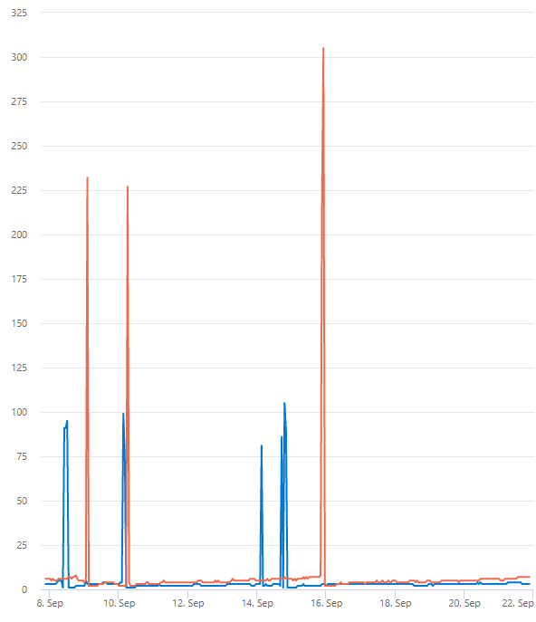

# Performance testing of MSAL.NET

[Microsoft.Identity.Test.Performance](https://github.com/AzureAD/microsoft-authentication-library-for-dotnet/tree/main/tests/Microsoft.Identity.Test.Performance) project uses [BenchmarkDotNet](https://benchmarkdotnet.org/articles/overview.html) library for performance testing of MSAL functionality. [Program.cs](https://github.com/AzureAD/microsoft-authentication-library-for-dotnet/blob/main/tests/Microsoft.Identity.Test.Performance/Program.cs) contains benchmark classes used to test different scenarios.

This performance test project is a console app. Behind the scenes when the project is run, BenchmarkDotNet builds and outputs this test project into a temporary working directory. Then it creates a separate process where all the benchmarking measurements are done.

BenchmarkDotNet is customizable.  BenchmarkDotNet tests are set up similarly to unit tests, using attributes. Benchmarks can be parametrized. There are global and iteration [setup and cleanup](https://benchmarkdotnet.org/articles/features/setup-and-cleanup.html) methods that can be used to setup the environment before running actual tests. The number of times that a benchmark should run can be customized, although it is recommended to use the defaults, as the BenchmarkDotNet does it's own pre-processing to find the optimal number of runs. [How it works](https://benchmarkdotnet.org/articles/guides/how-it-works.html) guide describes the steps that BenchmarkDotNet takes to run the benchmarks. BenchmarkDotNet supports running tests on [multiple frameworks](https://benchmarkdotnet.org/articles/configs/toolchains.html#multiple-frameworks-support).

## Running tests

There are multiple ways to run the tests locally.

One way:

- Build Microsoft.Client.Test.Performance project in `Release` mode.
- Go to the `{project directory}/bin/Release/{framework directory}/` and run the project executable.
- The results will be printed to the console window.

Another way:

- Go to the project directory.
- Run `dotnet run -c Release` in the console window.

`BenchmarkDotNet.Artifacts` folder with the exported results will be created in the directory from which the executable was run from.

The test project can be ran multiple times using the methods above and then the results aggregated manually. Another way to run the project multiple times is to add `WithLaunchCount(this Job job, int count)` method in `Program.cs` when setting up the BenchmarkDotNet job. This will specify how many times the BenchmarkDotNet will launch the benchmark process. This can help reduce the variability between the test runs.

### Testing code changes

When making code changes to a performance critical code, make sure to run the tests to check for regressions.

To test locally:
- Build and run the perf project with the 'before' code state to establish baseline numbers.
- Make desired MSAL code changes.
- Again build and run the perf project to get the results for the 'after' state.
- Compare the results between the runs.
- Include the before and after results in the pull request that includes these changes. Also mention the PR and the improvements in the Improvements and test results section below.

The comparison can also be done using the build pipeline. Simply run the automated tests on the feature branch that has the new changes. Compare the results with any previous results from the runs on the main branch.

### Viewing results

Sample table with summary results:

|                Method |   CacheSize | EnableCacheSerialization |          Mean |      Gen0 |   Allocated |
|----------------------:|------------:|-------------------------:|--------------:|----------:|------------:|
| AcquireTokenForClient |           ? |                        ? |    261.408 us |         - |    69.58 KB |
| AcquireTokenForClient |     (1, 10) |                    False |     16.461 us |    0.8850 |    22.13 KB |
| AcquireTokenForClient |     (1, 10) |                     True |    163.788 us |   10.9863 |   271.28 KB |
| AcquireTokenForClient | (10000, 10) |                    False |     33.558 us |    0.8545 |    22.14 KB |
| AcquireTokenForClient | (10000, 10) |                     True |    176.403 us |   10.9863 |   271.28 KB |
| AcquireTokenForClient |     (1, 10) |                    False |     16.461 us |    0.8850 |    22.13 KB |
| AcquireTokenForClient |     (1, 10) |                     True |    163.788 us |   10.9863 |   271.28 KB |
| AcquireTokenForClient |   (1, 1000) |                    False |    226.126 us |    5.1270 |   130.85 KB |
| AcquireTokenForClient |   (1, 1000) |                     True | 25,559.469 us | 1093.7500 | 18362.87 KB |

Results are consolidated across all the iterations and launches. They are written to the console at the end of the run and also exported into `.md`, `.csv`, and `.html` files in `BenchmarkDotNet.Artifacts` folder by default. The results are grouped by the benchmark method and any parameters. The main metrics to pay attention to are mean speed and allocated memory. Compare these value across runs, before and after code changes.  The run log, which contains how many times benchmarks were executed and general debug information, is also exported into the same folder.

## Test automation

The process of running the tests described above is automated in two ways. The test suite runs as part of the Azure DevOps build pipeline when changes are merged into the main branch, and can also be run manually on a feature branch. Currently these results have to be compared manually. The test project is also run by a [Continuous Benchmark](https://github.com/marketplace/actions/continuous-benchmark) GitHub Action on merges into main branch or manually. If a regression is detected above a specified threshold, the action will fail. The test run results are uploaded to the GitHub Pages [dashboard](https://azuread.github.io/microsoft-authentication-library-for-dotnet/benchmarks/).

## Test cases

The tests cover common MSAL usage scenarios.

- **Method** - end-to-end token acquisition (for client, on-behalf-of, silent) or other operation (get account, remove account). The focus is to test commonly used methods in high-throughput applications. There are also other tests, like JSON operation or builder tests, which can be ran when needed.
- **Token cache size** - the number of tokens the cache is prepopulated with. The internal token cache is partitioned into key-value pairs. In the table above cache size column display it as `(number of keys/partitions, number of tokens per cache entry/partition/key)`. See [here](https://github.com/AzureAD/microsoft-authentication-library-for-dotnet/blob/main/src/client/Microsoft.Identity.Client/TokenCacheNotificationArgs.cs#L188-L191) for what the cache keys are in different scenarios.
  - First scenario covered is when the cache is empty, so the request goes all the way to HTTP manager (for testing, web calls are mocked).
  - A simple scenario few cache entries with few tokens in each (ex. few resources accessed for each tenant or by one user).
  - The more common scenario is many cache entries with few tokens in each. This also shows that the number of cache entries / keys doesn't affect the performance much (besides internal .NET operations) because the filtering operations to find a token are done only on the specific cache entry, which is retrieved in O(n) time.
  - A less common scenario is a lot of tokens per cache entry (generally for client credential app tokens).
- **Enabled token cache serialization** - whether cache serialization is enabled or disabled (as described in [docs](/azure/active-directory/develop/msal-net-token-cache-serialization?tabs=aspnetcore#monitor-cache-hit-ratios-and-cache-performance)). When disabled MSAL uses internal in-memory cache, pre-populated with tokens as described above. When enabled, MSAL pre-populates and serializes into a .NET Memory Cache structure. The serialization is what adds the perf hit between these two options.

## Improvements and test results

We regularly work on improving MSAL.NET performance. Performance related GitHub issues are tagged with [performance](https://github.com/AzureAD/microsoft-authentication-library-for-dotnet/labels/performance) label. Listed are some of the recent major improvements. See pull requests for performance data.

**PR [#2261](https://github.com/AzureAD/microsoft-authentication-library-for-dotnet/pull/2261)** includes improvements for `AcquireTokenForClient` method, especially when an internal token cache is large (100k+ items). Testing showed 10% - 30% speed improvement. Released in MSAL [4.24.0](https://github.com/AzureAD/microsoft-authentication-library-for-dotnet/releases/tag/4.24.0).

**PR [#2309](https://github.com/AzureAD/microsoft-authentication-library-for-dotnet/pull/2309)** includes a way to disable legacy caching with `WithLegacyCacheCompatibility` builder method. Disabling legacy cache, if not used, speeds up MSAL cache operations, especially for large caches. Released in MSAL [4.25.0](https://github.com/AzureAD/microsoft-authentication-library-for-dotnet/releases/tag/4.25.0).

**PR [#2834](https://github.com/AzureAD/microsoft-authentication-library-for-dotnet/pull/2834)** improved performance by removing unnecessary serialization and adding partitioning in default app token cache used in client credentials flow. Released in MSAL [4.36.0](https://github.com/AzureAD/microsoft-authentication-library-for-dotnet/releases/tag/4.36.0).
Diagram shows a performance improvement for P99 latency in milliseconds for client credentials call.

**PR [#2881](https://github.com/AzureAD/microsoft-authentication-library-for-dotnet/pull/2881)** significantly improved caching performance by adding partitioning to the default in-memory user cache used in user flows (like acquire token on-behalf-of, by authorization code). Released in MSAL [4.37.0](https://github.com/AzureAD/microsoft-authentication-library-for-dotnet/releases/tag/4.37.0).

**PR [#3233](https://github.com/AzureAD/microsoft-authentication-library-for-dotnet/pull/3233)** improves token filtering and reduces allocated memory. Released in MSAL [4.43.0](https://github.com/AzureAD/microsoft-authentication-library-for-dotnet/releases/tag/4.43.0).

**PR [#3250](https://github.com/AzureAD/microsoft-authentication-library-for-dotnet/pull/3250)** shows the performance of creating a new app builder and difference between acquire token calls that use serialization and don't.

**PR [#3605](https://github.com/AzureAD/microsoft-authentication-library-for-dotnet/pull/3605)** adds new .NET 6 target which uses System.Text.Json (STJ) library for JSON operations (instead of Newtonsoft Json.NET). When using .NET 6 MSAL binary with STJ over .NET Core 2.1 binary with Json.NET, the test results show an average 60% improvement in speed and memory allocation for JSON operations and an average 20% speed improvement for end-to-end token acquisition calls. Released in MSAL [4.48.0](https://github.com/AzureAD/microsoft-authentication-library-for-dotnet/releases/tag/4.48.0).

## Metrics

See information about MSAL-provided metrics in [token cache documentation](/azure/active-directory/develop/msal-net-token-cache-serialization?tabs=aspnetcore#monitor-cache-hit-ratios-and-cache-performance).
