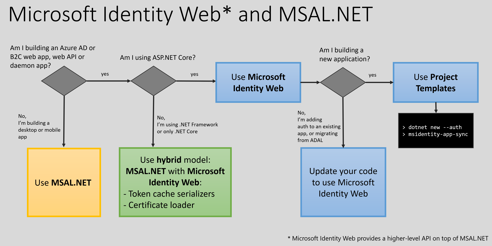
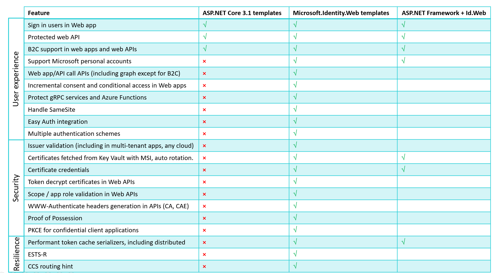
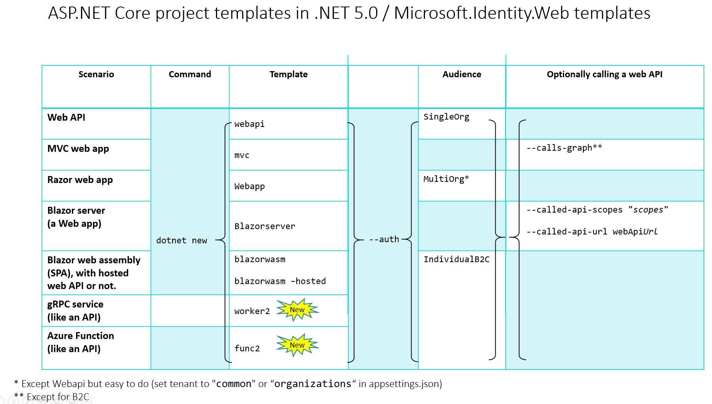
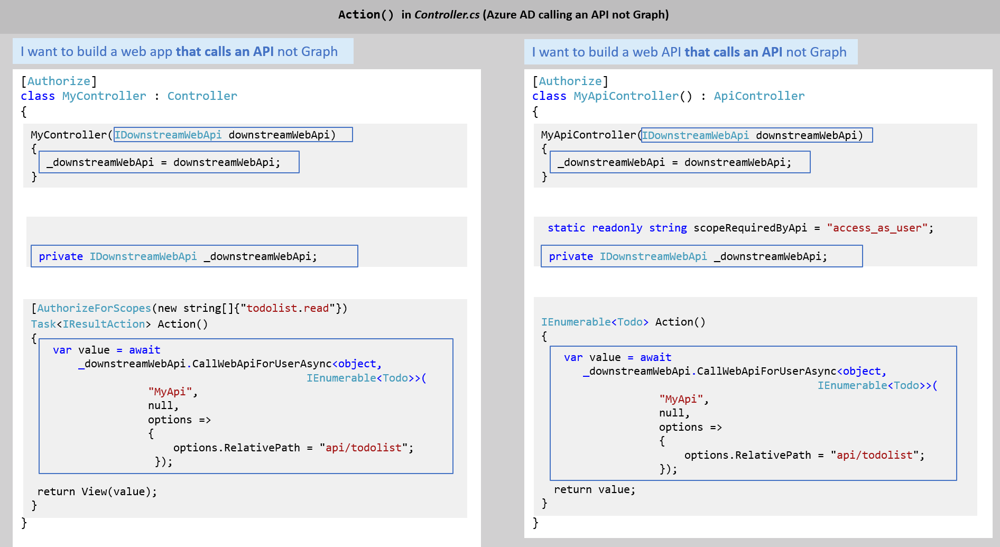
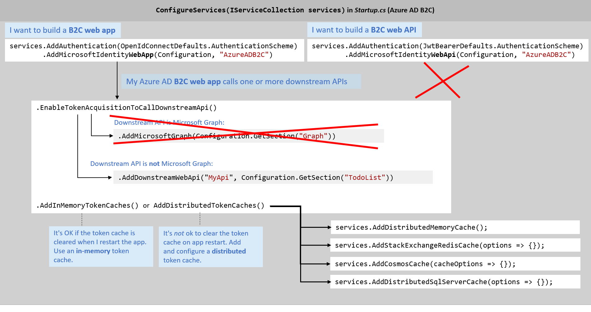
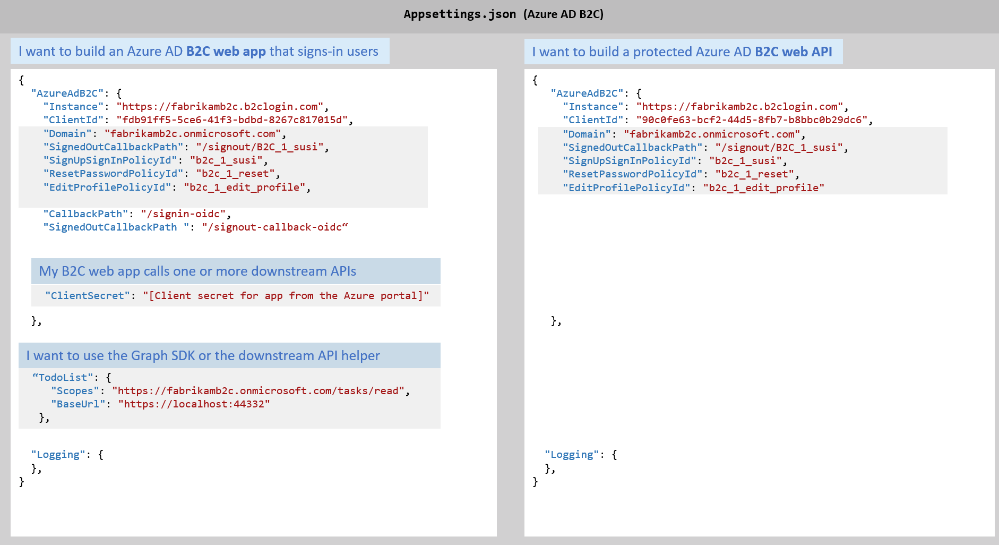
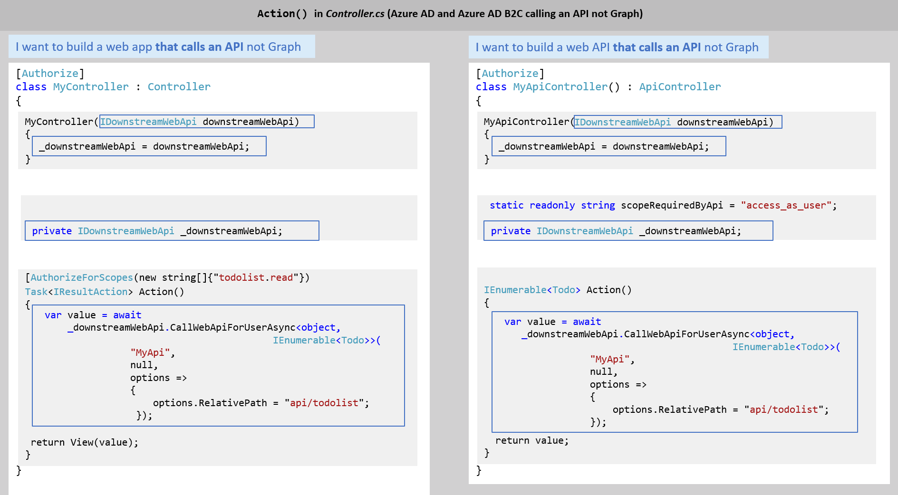
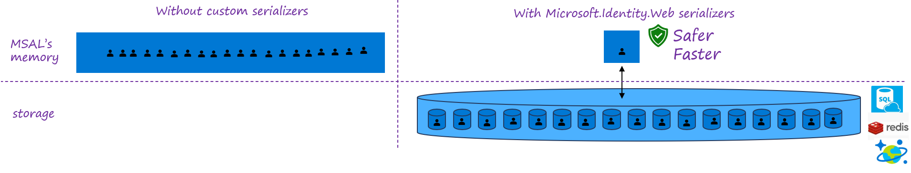

# Choosing a version of MSAL.NET

Depending on the type of application you're building, and its underlying platform, you can choose to use MSAL.NET, [Microsoft Identity Web](https://github.com/AzureAD/microsoft-identity-web), or both.

Microsoft Identity Web is a set of ASP.NET Core libraries that simplifies adding authentication and authorization support to web apps and web APIs integrating with the Microsoft identity platform. It provides a single-surface API convenience layer that ties together ASP.NET Core, its authentication middleware, and the Microsoft Authentication Library (MSAL) for .NET.

Follow the decision tree below to determine whether your scenario requires MSAL.NET, Microsoft Identity Web, or both.

## When do I use MSAL.NET

You're building a desktop or mobile app. Use MSAL.NET directly and start acquiring tokens for your public client application. For details see:

- [Acquiring token in a desktop app](/azure/active-directory/develop/scenario-desktop-acquire-token?tabs=dotnet), and using [WAM](../acquiring-tokens/desktop-mobile/wam.md)
- [Acquiring token in a mobile application](/azure/active-directory/develop/scenario-mobile-acquire-token)

## Use [Microsoft Identity Web](https://github.com/AzureAD/microsoft-identity-web/)

You're building a confidential client application (Web app, web API, daemon/service app) running on ASP.NET Core, ASP.NET OWIN, or .NET framework/.NET Core. See what Microsoft Identity Web has to offer:
- Sign in users in web apps in Azure AD application, Azure AD B2C, and CIAM applications
  - Support Microsoft personal accounts
  - Support guest users
  - Incremental consent and conditional access in web apps
  - Handle SameSite
  - Integrates with "App services authentication"
  - supports PKCE for confidential client applications
  - Brings performant token cache serializers, including distributed
- Protect web API (with Azure AD, Azure AD B2C or CIAM)
  - Validates the issuer (including in-multi-tenant apps, any cloud)
  - supports token decrypt certificates in Web APIs
  - Validates Scope and app role in Web APIs
  - generates WWW-authenticate headers in APIs (CA, CAE)
  - Protect gRPC services and Azure functions
- Web app/API calling downstream APIs (including graph except for B2C)
  - Call downstream APIs without having to handle authentication/tokens yourself.
  - Integrates with the graph SDK, and the Azure SDKs
  - Describe the client credentials, and Microsoft.Identity.Web fetches them for you (for
    instance certificates from KeyVault, or workload identity federation with AKS and MSI)
- Supports multiple Authentication schemes in ASP.NET Core
- Supports Proof of possession protocol 
- Resilient (supports regional token acquisition and  routing hint for the token backup system)

<!---
Built the table above from this image

-->

### You're building a new application

Use the Project Templates and the `msidentity-app-sync` tool. We have web app templates for web MVC, Razor, Blazor server, Blazorwasm hosted and not hosted. All for Azure AD or Azure AD B2C.

[Web app project templates](https://github.com/AzureAD/microsoft-identity-web/wiki/web-app-template).

We have web API templates for gRPC and Azure Functions.

[Web API project templates](https://github.com/AzureAD/microsoft-identity-web/wiki/web-api-template).

Here's information on how to run the [msidentity-app-sync-tool](https://github.com/AzureAD/microsoft-identity-web/blob/master/tools/app-provisioning-tool/README.md) which is a command line tool which creates Microsoft identity platform applications in a tenant (Azure AD or Azure AD B2C) and updates the configuration code of your ASP.NET Core applications. The tool can also be used to update code from an existing Azure AD/Azure AD B2C application.

It's available on [NuGet](https://www.nuget.org/packages/msidentity-app-sync/).

### You're adding auth to an existing app or I'm migrating from ADAL

Just take the code you need from Microsoft Identity Web to update your app. Here's an example:

## When do you use the hybrid model (MSAL.NET and [Microsoft Identity Web](https://github.com/AzureAD/microsoft-identity-web/))

You're building and SDK for confidential client applications and want to use MSAL.NET low level APIs. In MSAL.NET, an in-memory token cache is provided by default, however, in the case of web apps or web APIs, caching should be handled differently than for public client applications (desktop or mobile apps) as it requires to be partitioned correctly. It's highly recommended to leverage a token cache serializer, which can be a distributed cache, (e.g. Redis, Cosmos, or SQL Server, distributed in memory cache), or a correctly partitioned in memory cache.

By using token cache serializers you partition the token caches depending on the cache key that is used because the cache is swapped between the storage and MSAL's memory. This cache key is computed by MSAL.NET as a function of the flow you use

### Why do you need Microsoft Identity Web.TokenCache?

Microsoft Identity Web.TokenCache provides token cache serialization for you.  See [Token cache serialization](https://github.com/AzureAD/microsoft-identity-web/wiki/asp-net#token-cache-serialization-for-msalnet) for details.

Another example of leveraging Microsoft Identity Web from .NET classic (MVC) can be found in that [ConfidentialClientTokenCache sample](https://github.com/Azure-Samples/active-directory-dotnet-v1-to-v2/tree/master/ConfidentialClientTokenCache).

Examples of how to use token caches for web apps and web APIs are available in the [ASP.NET Core web app tutorial](/samples/azure-samples/active-directory-aspnetcore-webapp-openidconnect-v2/enable-webapp-signin/) in the phase [2-2 Token Cache](https://github.com/Azure-Samples/active-directory-aspnetcore-webapp-openidconnect-v2/tree/master/2-WebApp-graph-user/2-2-TokenCache). For implementations have a look at the [TokenCacheProviders](https://github.com/AzureAD/microsoft-identity-web/tree/master/src/Microsoft.Identity.Web/TokenCacheProviders) folder in the [Microsoft.Identity.Web](https://github.com/AzureAD/microsoft-identity-web) repository.

Microsoft Identity Web also helps with [certificate loading](https://github.com/AzureAD/microsoft-identity-web/wiki/asp-net#help-loading-certificates). 
