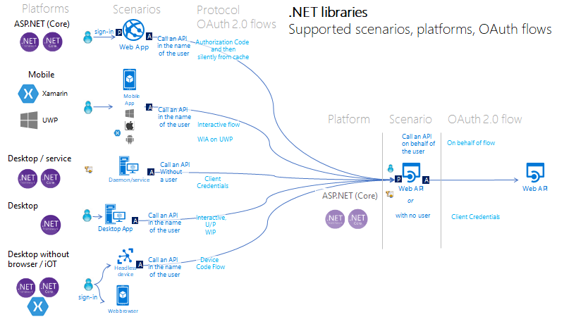
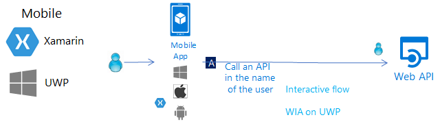
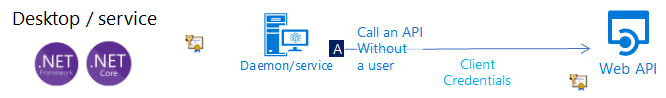
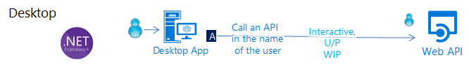
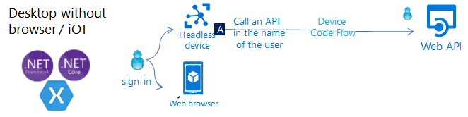
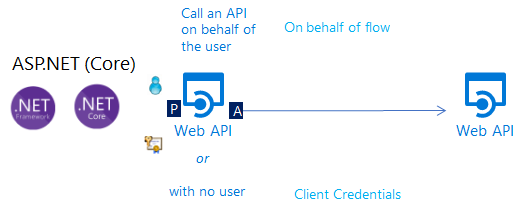

# MSAL.NET Scenarios

## Introduction

The .NET authentication libraries support scenarios involving **protecting a Web API** and **acquiring tokens** for a protected Web API. MSAL.NET is only used for the latter.

As a developer, you can acquire a token from a number of **application types**, including web applications, mobile applications, desktop applications, web APIs, and application running on devices that don't have a browser (or iOT). These types of applications are separated into two categories:

- Public client applications (desktop and Mmbile) use the <xref:Microsoft.Identity.Client.PublicClientApplication> class
- Confidential client applications (web apps, web APIs, and daemon applications - desktop or web). These type of apps use the <xref:Microsoft.Identity.Client.ConfidentialClientApplication>.

MSAL.NET supports acquiring tokens either in the name of a **user** , or, (and only for confidential client applications), in the name of the application itself (for no user). In that case the confidential client application shares a secret with Azure AD 

MSAL.NET supports a number of **platforms** (.NET Framework, .NET Core, Windows 10/UWP, Xamarin.iOS, Xamarin.Android). .NET Core apps can also run on different operating systems (Windows, but also Linux and MacOs). The scenarios can be different depending on the platforms.

## The Scenarios

The picture below summarizes the supported scenarios and shows on which platform, and to which Azure AD protocol this corresponds:

### Web app that signs in users and calls a web API on behalf of the user

To protect a web app (signing in the user) you'll use ASP.NET or ASP.NET Core with the ASP.NET Open ID Connect middleware. This involves validating the token which is done by the [IdentityModel extensions for .NET](https://github.com/AzureAD/azure-activedirectory-identitymodel-extensions-for-dotnet/wiki) library, not MSAL.NET.

To call the web API in the name of the user, you'll use MSAL.NET `ConfidentialClientApplication`, leveraging the [Authorization code flow](../acquiring-tokens/web-apps-apis/authorization-codes.md), then storing the acquired token in the token cache, and [acquiring a token silently](../acquiring-tokens/acquiretokensilentasync-api.md#recommended-call-pattern-in-web-apps-using-the-authorization-code-flow-to-authenticate-the-user) from the cache when needed. MSAL refreshes the token if needed.

### Mobile app that calls a web API on behalf of the user who's signed-in interactively

To call a web API from a mobile application, you use MSAL.NET's PublicClientApplication's [interactive](../acquiring-tokens/desktop-mobile/acquiring-tokens-interactively.md) token acquisition methods. These interactive methods enable you to control the sign-in UI experience, as well as the location of the interactive dialog on some platforms.

To enable this interaction, MSAL.NET leverages a [web browser](/azure/active-directory/develop/msal-net-web-browsers). There are specificities depending on the mobile platform ([UWP](../acquiring-tokens/desktop-mobile/uwp.md), [iOS](/azure/active-directory/develop/msal-net-xamarin-ios-considerations), or [Android](/azure/active-directory/develop/msal-net-xamarin-android-considerations)). On iOS and Android, you can even choose if you want to leverage the system browser (the default), or an embedded web browser. You can enable some kind of token cache sharing on iOS.

#### Protecting the app itself with InTune

Your mobile app (written in Xamarin.iOS or Xamarin.Android) can have app protection policies applied to it, so that it can be [managed by InTune](/intune/app-sdk) and recognized by InTune as a managed app. The [InTune SDK](/intune/app-sdk-get-started) is separate from MSAL, and it talks to Azure AD on its own.

### Desktop or service daemon app that calls a web API as itself (in its own name)

You can write a daemon app that acquires a token using its own identity on top using MSAL.NET's ConfidentialClientApplication's [client credentials](../acquiring-tokens/web-apps-apis/client-credential-flows.md) acquisition methods. These suppose that the app has previously registered a secret (application password or certificate) with Azure AD, which it then shares with this call.

### Desktop app that calls a web API on behalf of a signed-in user

Desktop applications can use the same [interactive authentication](../acquiring-tokens/desktop-mobile/acquiring-tokens-interactively.md) as the [mobile applications](#Mobile-app-that-calls-a-web-API-on-behalf-of-the-user-who's-signed-in-interactively).

For Windows hosted applications, it's also possible for applications running on computers joined to a Windows domain or Azure AD joined to acquire a token silently by using [Integrated Windows Authentication](../acquiring-tokens/desktop-mobile/integrated-windows-authentication.md).

If your desktop application is a .NET Core application running on Linux or Mac, you can neither use the interactive authentication flow (as .NET Core does not provide a [web browser](/azure/active-directory/develop/msal-net-web-browsers)), nor Integrated Windows Authentication. The best option in that case is to use device code flow as explained in [Application without a browser, or iOT application calling an API in the name of the user](#application-without-a-browser-or-iot-application-calling-an-api-in-the-name-of-the-user).

Although not recommended, you can use the [Username-password flow](../acquiring-tokens/desktop-mobile/username-password-authentication.md) in public client applications; It's still needed in some scenarios (like DevOps), but beware that using it imposes constraints on your application. For instance, you can't sign-in users who need to perform Multi Factor Authentication (conditional access) or leverage the benefits of single sign-on (SSO). The username-password flow goes against the principles of modern authentication and is only provided for legacy reasons.

In desktop applications, if you want the token cache to be persistent, you should [customize the token cache serialization](/azure/active-directory/develop/msal-net-token-cache-serialization).

### Application without a browser, or iOT application calling an API in the name of the user

Applications running on a device without a browser will still be able to call an API in the name of a user, after having the user sign-in on another device which has a web browser. For this you'll need to use the [Device Code flow](../acquiring-tokens/desktop-mobile/device-code-flow.md)

### Web API calling another downstream Web API in the name of the user for whom it was called

If you want your ASP.NET or ASP.NET Core protected web API to call another web API on behalf of the user represented by the access token was used to call you API, you will need to:

- Validate the token. For this you'll use the ASP.NET JWT middleware under the hood. This also involves validating the token which is done by the [IdentityModel extensions for .NET](https://github.com/AzureAD/azure-activedirectory-identitymodel-extensions-for-dotnet/wiki) library, not MSAL.NET
- Then you will need to acquire a token for the downstream web API by using the ConfidentialClientApplication's method Acquiring a token on [behalf of a user](../acquiring-tokens/web-apps-apis/on-behalf-of-flow.md) in service-to-service calls.
- Web APIs calling other web API will also need to provide a [custom cache serialization](/azure/active-directory/develop/msal-net-token-cache-serialization).

### Web API calling another API in its own name

Like in desktop or service daemon applications, a daemon web API (or a daemon web app) can use MSAL.NET's ConfidentialClientApplication's [client credentials](../acquiring-tokens/web-apps-apis/client-credential-flows.md) acquisition methods. 

## Transverse features

In all the scenarios you might want to:

- Troubleshoot yourself by activating [logs](/azure/active-directory/develop/msal-logging-dotnet) or Telemetry
- Understand how to react to [exceptions](../advanced/exceptions/index.md) due to the Azure AD service [`MsalServiceException`](/dotnet/api/microsoft.identity.client.msalserviceexception?view=azure-dotnet-preview#fields&preserve-view=true), or to something wrong happening in the client itself [`MsalClientException`](/dotnet/api/microsoft.identity.client.msalclientexception?view=azure-dotnet-preview#fields&preserve-view=true )
- Use MSAL.NET with a [proxy](../advanced/httpclient.md)
