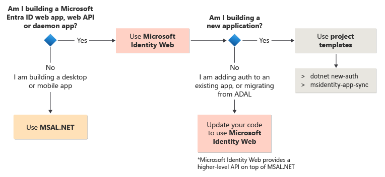

# Migrating applications to MSAL.NET or Microsoft.Identity.Web

[!INCLUDE [ADAL migration note](../includes/adal-migration-note.md)]

## Why migrate to MSAL.NET or Microsoft.Identity.Web

Both the Microsoft Authentication Library for .NET (MSAL.NET) and Azure AD Authentication Library for .NET (ADAL.NET) are used to authenticate Microsoft Entra entities and request tokens from Microsoft Entra ID.

Up until now, most developers have requested tokens from Microsoft Entra ID for developers platform (v1.0) using Azure AD Authentication Library (ADAL). These tokens are used to authenticate Microsoft Entra identities (work and school accounts).

Because ADAL is deprecated, we **strongly advise** our customers to migrate to MSAL or higher-level libraries that are based on MSAL, such as `Microsoft.Identity.Web`. MSAL offers several key benefits:

- You can authenticate a broader set of Microsoft identities: work or school accounts, personal Microsoft accounts, and social or local accounts with Azure AD B2C and Microsoft Entra External ID.
- Your users get the best single-sign-on (SSO) experience.
- Your application can enable incremental consent, Conditional Access, and other emerging security capabilities.
- You benefit from continuous innovation in terms of security and resilience,

>[!IMPORTANT]
>**MSAL.NET or Microsoft.Identity.Web are now the recommended auth libraries to use with the Microsoft identity platform**. No new features will be implemented in ADAL. For details see the announcement: [Update your applications from ADAL to MSAL](https://devblogs.microsoft.com/identity/update-your-applications-from-adal-to-msal/).

## Should you migrate to MSAL.NET or to Microsoft.Identity.Web

Before digging in the details of MSAL.NET vs ADAL.NET, you might want to check if you want to use MSAL.NET or a higher-level library like [`Microsoft.Identity.Web`](../microsoft-identity-web/index.md).

For details about the decision tree below, read [MSAL.NET or Microsoft.Identity.Web](../getting-started/choosing-msal-dotnet.md).

### Deprecated ADAL.NET NuGet packages and their MSAL.NET equivalents

You might unknowingly consume ADAL dependencies from other Azure SDKs. Below are few of the deprecated packages and their MSAL alternatives. For more detailed migration information, see [AppAuthentication to Azure.Identity Migration Guidance](/dotnet/api/overview/azure/app-auth-migration) and **Migration guide** links in the specific [Azure SDK for .NET](/dotnet/api/overview/azure/) library pages.

|  Legacy Package (ADAL-dependent, deprecated)                  | Supported Package (MSAL-dependent, current) |
| ------------------------------------------------------------- | ---------------------------------------------------------------------------------------------------- |
| `Microsoft.Azure.KeyVault`                                    | `Azure.Security.KeyVault.Secrets, Azure.Security.KeyVault.Keys, Azure.Security.KeyVault.Certificates`|
| `Microsoft.Azure.Management.Compute`                          | `Azure.ResourceManager.Compute`                                                                      |
| `Microsoft.Azure.Services.AppAuthentication`                  | `Azure.Identity`                                                                                     |
| `Microsoft.Azure.Management.StorageSync`                      | `Azure.ResourceManager.StorageSync`                                                                  |
| `Microsoft.Azure.Management.Fluent`                           | `Azure.ResourceManager`                                                                              |
| `Microsoft.Azure.Management.EventGrid`                        | `Azure.ResourceManager.EventGrid`                                                                    |
| `Microsoft.Azure.Management.Automation`                       | `Azure.ResourceManager.Automation`                                                                   |
| `Microsoft.Azure.Management.Compute.Fluent`                   | `Azure.ResourceManager.Compute`                                                                      |
| `Microsoft.Azure.Management.MachineLearning.Fluent`           | `Azure.ResourceManager.MachineLearningCompute`                                                       |
| `Microsoft.Azure.Management.Media, windowsazure.mediaservices`| `Azure.ResourceManager.Media`                                                                        |

## Next steps

- Learn about [public client and confidential client applications](/entra/identity-platform/msal-client-applications).
- Learn how to [migrate confidential client applications built on top of ASP.NET MVC or .NET classic from ADAL.NET to MSAL.NET](migrate-confidential-client.md).
- Learn how to [migrate public client applications built on top of .NET or .NET classic from ADAL.NET to MSAL.NET](migrate-public-client.md).
- Learn more about the [Differences between ADAL.NET and MSAL.NET apps](differences-adal-msal-net.md).
- Learn how to migrate confidential client applications built on top of ASP.NET Core from ADAL.NET to Microsoft.Identity.Web:
  - [Web apps](https://github.com/AzureAD/microsoft-identity-web/wiki/web-apps#migrating-from-previous-versions--adding-authentication)
  - [Web APIs](https://github.com/AzureAD/microsoft-identity-web/wiki/web-apis)
