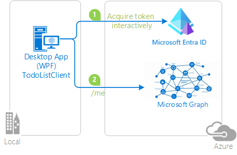

# Token cache serialization in MSAL.NET

After Microsoft Authentication Library (MSAL) [acquires a token](/azure/active-directory/develop/msal-acquire-cache-tokens), it caches that token. Public client applications (desktop and mobile apps) should try to get a token from the cache before acquiring a token by another method. Acquisition methods on confidential client applications manage the cache themselves. This article discusses default and custom serialization of the token cache in MSAL.NET.

## Quick summary

The recommendation is:
- When writing mobile apps, caching is already pre-configured by MSAL.
- When writing a desktop application, use the cross-platform token cache as explained in [desktop apps](token-cache-serialization.md?tabs=desktop).
- When writing new confidential client applications ([web apps](/azure/active-directory/develop/scenario-web-app-call-api-overview), [web APIs](/azure/active-directory/develop/scenario-web-api-call-api-overview), or [service-to-service or daemon apps](/azure/active-directory/develop/scenario-daemon-overview), use [Microsoft.Identity.Web](../microsoft-identity-web/index.md) as a higher-level API. It offers integration with ASP.NET Core, ASP.NET Classic, and works standalone as well.
- Existing confidential client applications that leverage MSAL.NET directly can continue to do so. 
- [Web apps](/azure/active-directory/develop/scenario-web-app-call-api-overview) and [web APIs](/azure/active-directory/develop/scenario-web-api-call-api-overview) should use a [distributed token cache](token-cache-serialization.md?tabs=aspnet#distributed-caches) (e.g., Redis, SQL Server, Azure Cosmos DB) in conjunction with a constrained memory cache. 
- Encryption at rest can be optionally configured using [ASP.NET Core Data Protection](/aspnet/core/security/data-protection/introduction).
- [Web apps](/azure/active-directory/develop/scenario-web-app-call-api-overview) may also rely on session cookies; however, this option is not recommended due to cookie size.
- [Service-to-service and daemon apps](token-cache-serialization.md?tabs=aspnet#distributed-caches) may rely on memory caching only. If your app serves many tenants, configure an eviction policy.
- Managed identity tokens are cached in memory only.

### Cache size

When users log in, there will be a cache entry for each user, around 7KB in size. The size will be larger if you are calling several downstream APIs. For service-to-service authentication, there will be a cache entry for each tenant and downstream API, around 2KB in size. 

## [Confidential clients using Microsoft.Identity.Web](#tab/aspnetcore)

The [Microsoft.Identity.Web.TokenCache](https://www.nuget.org/packages/Microsoft.Identity.Web.TokenCache) NuGet package provides token cache serialization within the [Microsoft.Identity.Web](https://github.com/AzureAD/microsoft-identity-web) library. The library provides integration with both ASP.NET Core and ASP.NET Classic, and its abstractions can be used to drive other web app or API frameworks. 

>[!NOTE]
> The examples below are for ASP.NET Core. For ASP.NET the code is similar, see [the `ms-identity-aspnet-wepapp-openidconnect` web app sample](https://github.com/Azure-Samples/ms-identity-aspnet-webapp-openidconnect/blob/master/WebApp/App_Start/Startup.Auth.cs) for a reference implementation.

| Extension method | Description  |
| ---------------- | ------------ |
| [AddInMemoryTokenCaches](/dotnet/api/microsoft.identity.web.microsoftidentityappcallswebapiauthenticationbuilder.addinmemorytokencaches) | Creates a temporary cache in memory for token storage and retrieval. In-memory token caches are faster than other cache types, but their tokens aren't persisted between application restarts, and you can't control the cache size. In-memory caches are good for applications that don't require tokens to persist between app restarts. Use an in-memory token cache in apps that participate in machine-to-machine auth scenarios like services, daemons, and others that use [AcquireTokenForClient](/dotnet/api/microsoft.identity.client.acquiretokenforclientparameterbuilder) (the client credentials grant). In-memory token caches are also good for sample applications and during local app development. Microsoft.Identity.Web versions 1.19.0+ share an in-memory token cache across all application instances.
| [AddSessionTokenCaches](/dotnet/api/microsoft.identity.web.microsoftidentityappcallswebapiauthenticationbuilderextension.addsessiontokencaches) | The token cache is bound to the user session. This option isn't ideal if the ID token contains many claims, because the cookie becomes too large.
| `AddDistributedTokenCaches` | The token cache is an adapter against the ASP.NET Core `IDistributedCache` implementation. It enables you to choose between a distributed memory cache, a Redis cache, a distributed NCache, or a SQL Server cache. For details about the `IDistributedCache` implementations, see [Distributed memory cache](/aspnet/core/performance/caching/distributed).

### In-memory token cache

Here's an example of code that uses the in-memory cache in the [ConfigureServices](/dotnet/api/microsoft.aspnetcore.hosting.startupbase.configureservices) method of the [Startup](/aspnet/core/fundamentals/startup) class in an ASP.NET Core application:

```CSharp
using Microsoft.Identity.Web;

public class Startup
{
 const string scopesToRequest = "user.read";
  
  public void ConfigureServices(IServiceCollection services)
  {
   // code before
   services.AddAuthentication(OpenIdConnectDefaults.AuthenticationScheme)
           .AddMicrosoftIdentityWebApp(Configuration)
             .EnableTokenAcquisitionToCallDownstreamApi(new string[] { scopesToRequest })
                .AddInMemoryTokenCaches();
   // code after
  }
  // code after
}
```

`AddInMemoryTokenCaches` is suitable in production if you request app-only tokens. If you use user tokens, consider using a distributed token cache. 

Token cache configuration code is similar between ASP.NET Core web apps and web APIs.

### Distributed token caches

Here are examples of possible distributed caches:

```C#
// or use a distributed Token Cache by adding
   services.AddAuthentication(OpenIdConnectDefaults.AuthenticationScheme)
           .AddMicrosoftIdentityWebApp(Configuration)
             .EnableTokenAcquisitionToCallDownstreamApi(new string[] { scopesToRequest }
               .AddDistributedTokenCaches();

// Distributed token caches have a L1/L2 mechanism.
// L1 is in memory, and L2 is the distributed cache
// implementation that you will choose below.
// You can configure them to limit the memory of the 
// L1 cache, encrypt, and set eviction policies.
services.Configure<MsalDistributedTokenCacheAdapterOptions>(options => 
  {
    // Optional: Disable the L1 cache in apps that don't use session affinity
    //                 by setting DisableL1Cache to 'true'.
    options.DisableL1Cache = false;
    
    // Or limit the memory (by default, this is 500 MB)
    options.L1CacheOptions.SizeLimit = 1024 * 1024 * 1024; // 1 GB

    // You can choose if you encrypt or not encrypt the cache
    options.Encrypt = false;

    // And you can set eviction policies for the distributed
    // cache.
    options.SlidingExpiration = TimeSpan.FromHours(1);
  });

// Then, choose your implementation of distributed cache
// -----------------------------------------------------

// good for prototyping and testing, but this is NOT persisted and it is NOT distributed - do not use in production
services.AddDistributedMemoryCache();

// Or a Redis cache
// Requires the Microsoft.Extensions.Caching.StackExchangeRedis NuGet package
services.AddStackExchangeRedisCache(options =>
{
 options.Configuration = "localhost";
 options.InstanceName = "SampleInstance";
});

// You can even decide if you want to repair the connection
// with Redis and retry on Redis failures. 
services.Configure<MsalDistributedTokenCacheAdapterOptions>(options => 
{
  options.OnL2CacheFailure = (ex) =>
  {
    if (ex is StackExchange.Redis.RedisConnectionException)
    {
      // action: try to reconnect or something
      return true; //try to do the cache operation again
    }
    return false;
  };
});

// Or even a SQL Server token cache
// Requires the Microsoft.Extensions.Caching.SqlServer NuGet package
services.AddDistributedSqlServerCache(options =>
{
 options.ConnectionString = _config["DistCache_ConnectionString"];
 options.SchemaName = "dbo";
 options.TableName = "TestCache";
});

// Or an Azure Cosmos DB cache
// Requires the Microsoft.Extensions.Caching.Cosmos NuGet package
services.AddCosmosCache((CosmosCacheOptions cacheOptions) =>
{
    cacheOptions.ContainerName = Configuration["CosmosCacheContainer"];
    cacheOptions.DatabaseName = Configuration["CosmosCacheDatabase"];
    cacheOptions.ClientBuilder = new CosmosClientBuilder(Configuration["CosmosConnectionString"]);
    cacheOptions.CreateIfNotExists = true;
});
```

For more information, see:
- [Distributed cache encryption and other advanced options](https://github.com/AzureAD/microsoft-identity-web/wiki/L1-Cache-in-Distributed-(L2)-Token-Cache)
- [Handle L2 cache eviction](https://github.com/AzureAD/microsoft-identity-web/wiki/Handle-L2-cache-eviction)
- [Set up a Redis cache in Docker](https://github.com/AzureAD/microsoft-identity-web/wiki/Set-up-a-Redis-cache-in-Docker)
- [Troubleshooting](https://github.com/AzureAD/microsoft-identity-web/wiki/Token-Cache-Troubleshooting)

The usage of distributed cache is featured in the [ASP.NET Core web app tutorial](/aspnet/core/tutorials/first-mvc-app/) in the [phase 2-2 token cache](https://github.com/Azure-Samples/active-directory-aspnetcore-webapp-openidconnect-v2/tree/master/2-WebApp-graph-user/2-2-TokenCache).

## [Confidential clients using MSAL.NET](#tab/msal)

.NET confidential clients are recommended to use [Microsoft.Identity.Web](../microsoft-identity-web/index.md), which is based on MSAL.NET, as higher level APIs are able to handle complex scenarios out-of-the-box (e.g., guest users, Conditional Access Evaluation, Proof-of-Possession tokens). Applications that need to access Azure APIs should use [Azure SDK](https://azure.github.io/azure-sdk/), which leverages MSAL internally.

The following material is relevant if you're using MSAL.NET directly.

### Available caching technologies

- Memory cache without eviction
- Memory cache with eviction
- Combined distributed and memory caches

<a id="no-token-cache-serialization"></a>
#### Memory Cache without eviction

Use `.WithCacheOptions(CacheOptions.EnableSharedCacheOptions)` when building a service-to-service application - `AcquireTokenForClient` that does not target many (more than 100,000) tenants.

> [!IMPORTANT]
> There is no way to control the size of the cache with this option. If you are building a website, a web API, or a multi-tenant S2S app, then use the `In-memory token cache` option.

```CSharp
    // Create the confidential client application
    app= ConfidentialClientApplicationBuilder.Create(clientId)
       // Alternatively to the certificate, you can use .WithClientSecret(clientSecret)
       .WithCertificate(cert)
       .WithLegacyCacheCompatibility(false)
       .WithCacheOptions(CacheOptions.EnableSharedCacheOptions)
       .WithAuthority(authority)
       .Build();
```

`WithCacheOptions(CacheOptions.EnableSharedCacheOptions)` makes the internal MSAL token cache shared between MSAL client application instances. Sharing a token cache is faster than using any token cache serialization, but the internal in-memory token cache doesn't have eviction policies. Existing tokens are refreshed in place, but fetching tokens for different users, tenants, and resources makes the cache grow accordingly. 

### Memory Cache with eviction

Reference the [Microsoft.Identity.Web.TokenCache](https://www.nuget.org/packages/Microsoft.Identity.Web.TokenCache) NuGet package to your project.

The following code shows how to add an in-memory cache with eviction:

```CSharp
using Microsoft.Identity.Web;
using Microsoft.Identity.Client;
using Microsoft.Extensions.DependencyInjection;

public static async Task<AuthenticationResult> GetTokenAsync(string clientId, X509Certificate cert, string authority, string[] scopes)
 {
     // Create the confidential client application
     app= ConfidentialClientApplicationBuilder.Create(clientId)       
       .WithCertificate(cert)
       .WithLegacyCacheCompatibility(false)
       .WithAuthority(authority)
       .Build();

     // Add a static in-memory token cache and set an eviction policy
     app.AddInMemoryTokenCache(services =>
     {
         // Configure the memory cache options
         services.Configure<MemoryCacheOptions>(options =>
         {
              options.SizeLimit = 500 * 1024 * 1024; // in bytes (500 MB)
         });
      });
  }
```

### Distributed caches

If you use `app.AddDistributedTokenCache`, the token cache is an adapter against the .NET `IDistributedCache` implementation. So you can choose between a SQL Server cache, a Redis cache, an Azure Cosmos DB cache, or any other cache implementing the [IDistributedCache](/dotnet/api/microsoft.extensions.caching.distributed.idistributedcache?view=dotnet-plat-ext-6.0&preserve-view=true) interface. 

For testing purposes, you can use `services.AddDistributedMemoryCache()`, an in-memory implementation of `IDistributedCache`. 

Here's the code for a SQL Server cache:

```CSharp 
     // SQL Server token cache
     app.AddDistributedTokenCache(services =>
     {
      services.AddDistributedSqlServerCache(options =>
      {
       
       // Requires to reference Microsoft.Extensions.Caching.SqlServer
       options.ConnectionString = @"Data Source=(localdb)\MSSQLLocalDB;Initial Catalog=TestCache;Integrated Security=True;Connect Timeout=30;Encrypt=False;TrustServerCertificate=False;ApplicationIntent=ReadWrite;MultiSubnetFailover=False";
       options.SchemaName = "dbo";
       options.TableName = "TestCache";

       // You don't want the SQL token cache to be purged before the access token has expired. Usually
       // access tokens expire after 1 hour (but this can be changed by token lifetime policies), whereas
       // the default sliding expiration for the distributed SQL database is 20 mins. 
       // Use a value above 60 mins (or the lifetime of a token in case of longer-lived tokens)
       options.DefaultSlidingExpiration = TimeSpan.FromMinutes(90);
      });
     });
```

Here's the code for a Redis cache:

```CSharp 
    // Redis token cache
    app.AddDistributedTokenCache(services =>
    {
      // Requires to reference Microsoft.Extensions.Caching.StackExchangeRedis
       services.AddStackExchangeRedisCache(options =>
       {
         options.Configuration = "localhost";
         options.InstanceName = "Redis";
       });

      // You can even decide if you want to repair the connection
      // with Redis and retry on Redis failures. 
      services.Configure<MsalDistributedTokenCacheAdapterOptions>(options => 
      {
        options.OnL2CacheFailure = (ex) =>
        {
          if (ex is StackExchange.Redis.RedisConnectionException)
          {
            // action: try to reconnect or something
            return true; //try to do the cache operation again
          }
          return false;
        };
      });
    });
```

Here's the code for an Azure Cosmos DB cache:

```CSharp 
      // Azure Cosmos DB token cache
      app.AddDistributedTokenCache(services =>
      {
        // Requires to reference Microsoft.Extensions.Caching.Cosmos
        services.AddCosmosCache((CosmosCacheOptions cacheOptions) =>
        {
          cacheOptions.ContainerName = Configuration["CosmosCacheContainer"];
          cacheOptions.DatabaseName = Configuration["CosmosCacheDatabase"];
          cacheOptions.ClientBuilder = new CosmosClientBuilder(Configuration["CosmosConnectionString"]);
          cacheOptions.CreateIfNotExists = true;
        });
       });
```

For more information about distributed caches, see:

- [Distributed cache encryption and advanced options](https://github.com/AzureAD/microsoft-identity-web/wiki/L1-Cache-in-Distributed-(L2)-Token-Cache)
- [Handle L2 cache eviction](https://github.com/AzureAD/microsoft-identity-web/wiki/Handle-L2-cache-eviction)
- [Set up a Redis cache in Docker](https://github.com/AzureAD/microsoft-identity-web/wiki/Set-up-a-Redis-cache-in-Docker)
- [Troubleshooting](https://github.com/AzureAD/microsoft-identity-web/wiki/Token-Cache-Troubleshooting)

### Disabling a legacy token cache

MSAL has some internal code specifically to enable interacting with legacy Microsoft Authentication Library (ADAL) cache. When MSAL and ADAL aren't used side by side, the legacy cache isn't used and the related legacy code is unnecessary. MSAL [4.25.0](https://github.com/AzureAD/microsoft-authentication-library-for-dotnet/releases/tag/4.25.0) adds the ability to disable legacy ADAL cache code and improve cache usage performance. For a performance comparison before and after disabling the legacy cache, see [GitHub pull request 2309](https://github.com/AzureAD/microsoft-authentication-library-for-dotnet/pull/2309). 

Call `.WithLegacyCacheCompatibility(false)` on an application builder like the following code.

```csharp
var app = ConfidentialClientApplicationBuilder
	.Create(clientId)
	.WithClientSecret(clientSecret)
	.WithLegacyCacheCompatibility(false)
	.Build();
```

### Samples

- The following sample showcases using the token cache serializers in .NET Framework and .NET Core applications: [ConfidentialClientTokenCache](https://github.com/Azure-Samples/active-directory-dotnet-v1-to-v2/tree/master/ConfidentialClientTokenCache). 
- The following sample is an ASP.NET web app that uses the same techniques: [Use OpenID Connect to sign in users to Microsoft identity platform](https://github.com/Azure-Samples/ms-identity-aspnet-webapp-openidconnect).

## [Desktop apps](#tab/desktop)

In desktop applications, we recommend that you use the cross-platform token cache. MSAL.NET provides the cross-platform token cache in a separate library named [Microsoft.Identity.Client.Extensions.MSAL](https://github.com/AzureAD/microsoft-authentication-extensions-for-dotnet).

#### Referencing the NuGet package

Add the [Microsoft.Identity.Client.Extensions.Msal](https://www.nuget.org/packages/Microsoft.Identity.Client.Extensions.Msal/) NuGet package to your project.

#### Configuring the token cache

For details, see the [Cross platform Token Cache](https://github.com/AzureAD/microsoft-authentication-extensions-for-dotnet/wiki/Cross-platform-Token-Cache). Here's an example using the cross-platform token cache:

```csharp
 var storageProperties =
     new StorageCreationPropertiesBuilder(Config.CacheFileName, Config.CacheDir)
     .WithLinuxKeyring(
         Config.LinuxKeyRingSchema,
         Config.LinuxKeyRingCollection,
         Config.LinuxKeyRingLabel,
         Config.LinuxKeyRingAttr1,
         Config.LinuxKeyRingAttr2)
     .WithMacKeyChain(
         Config.KeyChainServiceName,
         Config.KeyChainAccountName)
     .Build();

 IPublicClientApplication pca = PublicClientApplicationBuilder.Create(clientId)
    .WithAuthority(Config.Authority)
    .WithRedirectUri("http://localhost")  // make sure to register this redirect URI for the interactive login 
    .Build();
    

// This hooks up the cross-platform cache into MSAL
var cacheHelper = await MsalCacheHelper.CreateAsync(storageProperties );
cacheHelper.RegisterCache(pca.UserTokenCache);
         
```

#### Plain-text fallback mode

The cross-platform token cache allows you to store unencrypted tokens in an ACL-restricted plain-text file. This is useful in cases where encryption at rest fails, which ocassionally happens due to environmnent-related reasons. You can use the plain-text fallback mode by using the following code pattern:

```csharp
storageProperties =
    new StorageCreationPropertiesBuilder(
        Config.CacheFileName + ".plaintext",
        Config.CacheDir)
    .WithUnprotectedFile()
    .Build();

var cacheHelper = await MsalCacheHelper.CreateAsync(storageProperties).ConfigureAwait(false);
```

## [Mobile apps](#tab/mobile)

MSAL.NET provides an in-memory token cache by default. Serialization is provided by default for MAUI mobile targets.

## [Write your own cache](#tab/custom)

If you want to write your own token cache serializer, MSAL.NET provides custom token cache serialization in the .NET Framework and .NET Core subplatforms. Events are fired when the cache is accessed. Apps can choose whether to serialize or deserialize the cache. 

On confidential client applications that handle users (web apps that sign in users and call web APIs, and web APIs that call downstream web APIs), there can be many users. The users are processed in parallel. For security and performance reasons, our recommendation is to serialize one cache per user. Serialization events compute a cache key based on the identity of the processed user and serialize or deserialize a token cache for that user.

Remember, custom serialization isn't available on mobile platforms (UWP, Xamarin.iOS, and Xamarin.Android). MSAL already defines a secure and performant serialization mechanism for these platforms. .NET desktop and .NET Core applications, however, have varied architectures. And MSAL can't implement a general-purpose serialization mechanism. 

For example, websites might choose to store tokens in a Redis cache, or desktop apps might store tokens in an encrypted file. So serialization isn't provided out of the box. To have a persistent token cache application in .NET desktop or .NET Core, customize the serialization.

The following classes and interfaces are used in token cache serialization:

- `ITokenCache` defines events to subscribe to token cache serialization requests and methods to serialize or deserialize the cache at various formats (MSAL 2.x and MSAL 3.x).
- `TokenCacheCallback` is a callback passed to the events so that you can handle the serialization. They are called with arguments of type `TokenCacheNotificationArgs`.
- `TokenCacheNotificationArgs` only provides the `ClientId` value of the application and a reference to the user for which the token is available.


> [!IMPORTANT]
> MSAL.NET creates token caches for you. It provides you with the `IToken` cache when you call an application's `UserTokenCache` and `AppTokenCache` properties. You're not supposed to implement the interface yourself. 
>
> Your responsibility, when you implement a custom token cache serialization, is to react to `BeforeAccess` and `AfterAccess` events (or their `Async` varieties). The `BeforeAccess` delegate is responsible for deserializing the cache, whereas the `AfterAccess` one is responsible for serializing the cache. Parts of these events store or load blobs, which are passed through the event argument to whatever storage you want.

The strategies are different depending on whether you're writing a token cache serialization for a [public client application](/azure/active-directory/develop/msal-client-applications) (desktop) or a [confidential client application](/azure/active-directory/develop/msal-client-applications) (web app, web API, daemon app).

### Custom token cache for a web app or web API (confidential client application)

If you want to write your own token cache serializer for confidential client applications, we recommend that you inherit from [Microsoft.Identity.Web.MsalAbstractTokenCacheProvider](https://github.com/AzureAD/microsoft-identity-web/blob/master/src/Microsoft.Identity.Web.TokenCache/MsalAbstractTokenCacheProvider.cs) and override the `WriteCacheBytesAsync` and `ReadCacheBytesAsync` methods.

Examples of token cache serializers are provided in [Microsoft.Identity.Web/TokenCacheProviders](https://github.com/AzureAD/microsoft-identity-web/blob/master/src/Microsoft.Identity.Web.TokenCache).

### Custom token cache for a desktop or mobile app (public client application)

MSAL.NET v2.x and later versions provide several options for serializing the token cache of a public client. You can serialize the cache only to the MSAL.NET format (the unified format cache is common across MSAL and the platforms).   
Customizing the token cache serialization to share the single sign-on state between ADAL.NET 3.x, ADAL.NET 5.x, and MSAL.NET is explained in part of the following sample: [active-directory-dotnet-v1-to-v2](https://github.com/Azure-Samples/active-directory-dotnet-v1-to-v2).

#### Simple token cache serialization (MSAL only)

The following code is an example of a naive implementation of custom serialization of a token cache for desktop applications. Here, the user token cache is a file in the same folder as the application.

After you build the application, you enable the serialization by calling the `TokenCacheHelper.EnableSerialization()` method and passing the application's `UserTokenCache` property.

```csharp
app = PublicClientApplicationBuilder.Create(ClientId)
    .Build();
TokenCacheHelper.EnableSerialization(app.UserTokenCache);
```

The `TokenCacheHelper` helper class is defined as:

```csharp
static class TokenCacheHelper
 {
  public static void EnableSerialization(ITokenCache tokenCache)
  {
   tokenCache.SetBeforeAccess(BeforeAccessNotification);
   tokenCache.SetAfterAccess(AfterAccessNotification);
  }

  /// <summary>
  /// Path to the token cache. Note that this could be something different, for instance, for MSIX applications:
  /// private static readonly string CacheFilePath =
  /// $"{Environment.GetFolderPath(Environment.SpecialFolder.LocalApplicationData)}\{AppName}\msalcache.bin";
  /// </summary>
  public static readonly string CacheFilePath = System.Reflection.Assembly.GetExecutingAssembly().Location + ".msalcache.bin3";

  private static readonly object FileLock = new object();


  private static void BeforeAccessNotification(TokenCacheNotificationArgs args)
  {
   lock (FileLock)
   {
    args.TokenCache.DeserializeMsalV3(File.Exists(CacheFilePath)
            ? ProtectedData.Unprotect(File.ReadAllBytes(CacheFilePath),
                                      null,
                                      DataProtectionScope.CurrentUser)
            : null);
   }
  }

  private static void AfterAccessNotification(TokenCacheNotificationArgs args)
  {
   // if the access operation resulted in a cache update
   if (args.HasStateChanged)
   {
    lock (FileLock)
    {
     // reflect changes in the persistent store
     File.WriteAllBytes(CacheFilePath,
                         ProtectedData.Protect(args.TokenCache.SerializeMsalV3(),
                                                 null,
                                                 DataProtectionScope.CurrentUser)
                         );
    }
   }
  }
 }
```

A product-quality, file-based token cache serializer for public client applications (for desktop applications running on Windows, Mac, and Linux) is available from the [Microsoft.Identity.Client.Extensions.Msal](https://github.com/AzureAD/microsoft-authentication-extensions-for-dotnet/tree/master/src/Microsoft.Identity.Client.Extensions.Msal) open-source library. You can include it in your applications from the following NuGet package: [Microsoft.Identity.Client.Extensions.Msal](https://www.nuget.org/packages/Microsoft.Identity.Client.Extensions.Msal/).

#### Dual token cache serialization (MSAL unified cache)

If you want to implement token cache serialization with the unified cache format (common to MSAL.NET 2.x and other MSALs of the same generation or older, on the same platform), take a look at the following sample: https://github.com/Azure-Samples/active-directory-dotnet-v1-to-v2/tree/master/TokenCacheMigration/ADAL2MSAL.

---

## Monitor cache hit ratios and cache performance

MSAL exposes important metrics as part of [AuthenticationResult.AuthenticationResultMetadata](/dotnet/api/microsoft.identity.client.authenticationresultmetadata) object. You can log these metrics to assess the health of your application.

| Metric       | Meaning     | When to trigger an alarm?    |
| :-------------: | :----------: | :-----------: |
|  `DurationTotalInMs` | Total time spent in MSAL, including network calls and cache.   | Alarm on overall high latency (> 1 second). Value depends on token source. From the cache: one cache access. From Microsoft Entra ID: two cache accesses plus one HTTP call. First ever call (per-process) takes longer because of one extra HTTP call. |
|  `DurationInCacheInMs` | Time spent loading or saving the token cache, which is customized by the app developer (for example, save to Redis).| Alarm on spikes. |
|  `DurationInHttpInMs`| Time spent making HTTP calls to Microsoft Entra ID.  | Alarm on spikes.|
|  `TokenSource` | Source of the token. Tokens are retrieved from the cache much faster (for example, ~100 ms versus ~700 ms). Can be used to monitor and alarm the cache hit ratio. | Use with `DurationTotalInMs`. |
|  `CacheRefreshReason` | Reason for fetching the access token from the identity provider. | Use with `TokenSource`. |

## Size approximations

When using a token cache, it's important to consider the potential size of the cache, especially for highly-available and distributed applications. The current estimates are:

### Application flows (`AcquireTokenForClient`, `AcquireTokenForManagedIdentity`)

- Only access tokens are cached. One token about 2-3KB when persisted. There will be 1 token per _app client ID_ \* tenants \* downstream resources. For example a multi-tenanted app serving 1000 tenants and needing tokens for Graph and SharePoint will use: 3KB * 1000 * 2 i.e. approximately 6 MB.

### Web site calling downstream web API (`AcquireTokenByAuthCode`)

- **Access tokens** – 4KB; 1 token per _app client ID_ \* user \* tenant \* downstream resource.
- **Refresh token** – 2KB; 1 token per _client app ID_ \* user.
- **ID token** – 2KB; 1 token per _client app ID_ \* user \* number of tenants where that user logs in.

>[!NOTE]
>We strongly recommend using the higher level APIs from [`Microsoft.Identity.Web`](https://github.com/AzureAD/microsoft-identity-web/) for this and not MSAL directly. The caching considerations are the same.

### Web API calling other web API (`AcquireTokenOnBehalfOf`)

Same as for web site scenario, but there will be 1 node for each session, not for each user. By default, MSAL identifies a session by hashing the upstream assertion, but this can be changed. See [Long Running OBO Processes.](/entra/msal/dotnet/acquiring-tokens/web-apps-apis/on-behalf-of-flow#long-running-obo-processes)

>[!NOTE]
>We strongly recommend using the higher level APIs from [`Microsoft.Identity.Web`](https://github.com/AzureAD/microsoft-identity-web/) for this and not MSAL directly. The caching considerations are the same.

## Next steps

The following samples illustrate token cache serialization.

| Sample | Platform | Description|
| ------ | -------- | ----------- |
|[active-directory-dotnet-desktop-msgraph-v2](https://github.com/azure-samples/active-directory-dotnet-desktop-msgraph-v2) | Desktop (WPF) | Windows Desktop .NET (WPF) application that calls the Microsoft Graph API. |
|[active-directory-dotnet-v1-to-v2](https://github.com/Azure-Samples/active-directory-dotnet-v1-to-v2) | Desktop (console) | Set of Visual Studio solutions that illustrate the migration of Azure AD v1.0 applications (using ADAL.NET) to Microsoft identity platform applications (using MSAL.NET). In particular, see [Token cache migration](https://github.com/Azure-Samples/active-directory-dotnet-v1-to-v2/blob/master/TokenCacheMigration/README.md) and [Confidential client token cache](https://github.com/Azure-Samples/active-directory-dotnet-v1-to-v2/tree/master/ConfidentialClientTokenCache). |
[ms-identity-aspnet-webapp-openidconnect](https://github.com/Azure-Samples/ms-identity-aspnet-webapp-openidconnect) | ASP.NET (net472) | Example of token cache serialization in an ASP.NET MVC application (using MSAL.NET).
